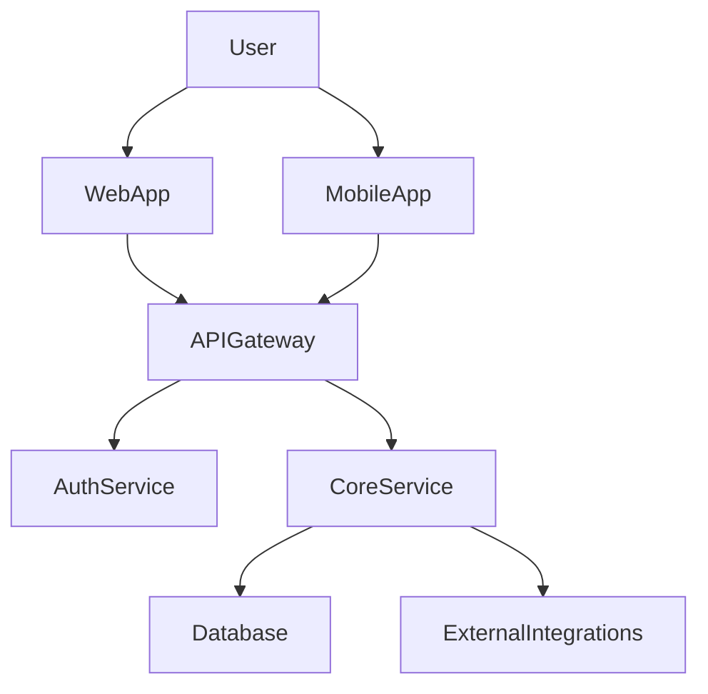

# Phase 7: DESIGN — Workstream Orchestration + COMPLIANCE Checker — Research

**Researched:** 2026-04-25
**Domain:** Business-planning meta-prompting + canonical gate replication + Korean compliance
**Confidence:** HIGH on canonical gate pattern; HIGH on Korea compliance content (inherited Phase 5 primers); MEDIUM on workstream content depth (planner determines exact slot definitions per `Claude's Discretion`); MEDIUM on FINANCIAL driver question wording (canonical 5 categories locked, exact wording is planner's domain).

## Summary

Phase 7 ships the BRIEF DESIGN runtime: `/brief-design <workstream>` orchestrating a single-workstream-per-session pipeline over 9 built-in workstreams (BMC / GTM / FINANCIAL / OPERATIONS / COMPLIANCE / ROADMAP / BRAND / RISK / TECH-ARCH), `/brief-add-workstream <name>` for dynamic addition with 1-session interactive Q&A, and the third instance of the canonical evaluator-optimizer gate pattern (COMPLIANCE checker on every artifact in every phase per CC-01).

The phase is the heaviest in the v1 ROADMAP (11 requirements: DSG-01..DSG-10 + CC-01) and the riskiest in two specific senses: (1) **canonical-pattern drift** — if COMPLIANCE deviates from the literal Phase 4 ALIGN / Phase 5 AUDIENCE shape, the structural test infrastructure breaks and Phase 8 inherits the drift; (2) **compliance theater regression** (Pitfall #4) — if the 2026 PIPA CEO personal liability finding lands as a green checkmark instead of a structured `FINDINGS-BLOCKING` verdict with the verbatim Korean disclaimer, the entire framework's credibility is gone in Korean enterprise contexts. Both risks are mitigated structurally: COMPLIANCE is a literal `compliance.cjs` + `compliance-report.cjs` + `agents/brief-compliance-checker.md` + `brief/workflows/compliance.md` copy-rename of `audience.cjs` / `audience-report.cjs` / `agents/brief-audience-guard.md` / `brief/workflows/audience-guard.md` (which is itself a copy-rename of the Phase 4 ALIGN files), preserving the 3-output verdict shape, paired-sibling filename scheme, vocabulary ban-list, deterministic-screen + LLM-pass hybrid, and 3-path interrupt UX verbatim. Sequential 3-gate threading (`ALIGN → AUDIENCE → COMPLIANCE`) lives inside the new `brief/workflows/design.md` orchestrator file with fail-fast on BLOCKING.

**Primary recommendation:** Execute Phase 7 as a structurally-disciplined fourth instance of the gate pattern (after ALIGN, AUDIENCE, gap-detect). NO novel structure. NO new severity tiers. NO on-demand re-gate commands. The 9 workstream contents are content-only (markdown templates + design-prompts) — no new agent files per workstream; one `brief-domain-researcher`-style parameterized spawn pattern is NOT used here because each workstream's `design-prompts.md` is the prompt template loaded by the orchestrator at spawn time. Surface cap NET +2: `/brief-design`, `/brief-add-workstream`. Korean PIPA disclaimer wording matches `brief/references/compliance/korea/pipa-2026.md` verbatim. FINANCIAL drivers MUST come from user input via 8-12 sequential AskUserQuestion calls covering 5 categories (revenue / cost / customers / capital / time); LLM never invents driver values. Atomic commits per logical step (9 + 5 = ~14 commits across the phase, each independently buildable).

## User Constraints (from CONTEXT.md)

### Locked Decisions (Areas A / B / C / D — D-01 through D-15)

**Area A — COMPLIANCE checker shape + pack scope:**

- **D-01:** COMPLIANCE 3-output verdict = `COMPLIANCE-OK / FINDINGS-MATERIAL / FINDINGS-BLOCKING`. Literal preservation of Phase 4/5 canonical shape.
- **D-02:** Sequential gate execution `ALIGN → AUDIENCE → COMPLIANCE`. Fail-fast on BLOCKING. No parallel spawn, no per-gate toggle, no skip flag.
- **D-03:** 2026 PIPA CEO personal liability + 10% turnover penalty surfaces as standard `FINDINGS-BLOCKING` with footer disclaimer mentioning CEO liability. NO new severity tier. NO top-of-report banner. Korean disclaimer when `state.brief.region == "kr"`.
- **D-04:** v1 compliance pack scope = Korea 3 (PIPA / ISMS-P / MyData) ONLY. Global packs (GDPR / SOC 2 / HIPAA / CCPA) deferred to v2 (CC-V2-01).

**Area B — /brief-design orchestrator UX:**

- **D-05:** Single workstream per `/brief-design` invocation. Command signature: `/brief-design <workstream-name> [args]`.
- **D-06:** OBJECTIVES.md insufficiency = pause + `/brief-define --amend` directive. NO return-stack push to DEFINE; return-stack remains DISCOVER↔DESIGN scoped.
- **D-07:** Soft-recommended dependency order: BMC → GTM → BRAND → OPERATIONS → FINANCIAL → RISK → ROADMAP → TECH-ARCH → COMPLIANCE. `depends_on: []` informational; never blocks.
- **D-08:** Workstream completion handoff = result summary + recommended next + AskUserQuestion 3-option (Continue / Stop here / Pick different).

**Area C — /brief-add-workstream flow depth:**

- **D-09:** spec.yaml auto-generated + 1-session interactive Q&A (4-6 questions): goal, output artifact, B2B/B2C variant Y/N, compliance focus areas, ordering, additional research prompts.
- **D-10:** Added workstreams auto-attach all 3 gates (`gates_required: [align, audience, compliance]` default; override allowed but discouraged).
- **D-11:** Name collision = BLOCK. Role overlap = "fork or new" 2-branch prompt (extend existing / genuinely new / cancel).

**Area D — 9 workstream template shape:**

- **D-12:** Artifact layout = `.planning/workstreams/{name}/{artifact}.md` with paired-sibling gates in same folder (`{artifact}.align.md`, `{artifact}.audience.md`, `{artifact}.compliance.md`, `{artifact}.gaps.md` optional).
- **D-13:** spec.yaml = 5 inherited Phase 2 fields + 2 new fields (`gates_required`, `depends_on`) = 7 total. Reconciles "최소 필수 6개" user signal to 7 by extending Phase 2 D-13's existing schema.
- **D-14:** B2B/B2C divergence = conditional prose blocks inside `design-prompts.md` (Phase 5 D-15 pattern preserved).
- **D-15:** FINANCIAL workstream uses guided 8-12 driver Q&A. User-supplied drivers → driver table → LLM computes 12-month projection from drivers ONLY. Sensitivity bands × 0.7 / 1.0 / 1.3 (bear / base / bull). Provenance tags: `[VERIFIED:user-supplied]` (driver-derived) or `[ASSUMED:multiplier-X]` (sensitivity multiplier).

### Claude's Discretion

The planner has flexibility on: exact COMPLIANCE checker prompt structure (template-friendly, mirror Phase 5); `{artifact}.compliance.md` body schema; CEO liability disclaimer Korean / English exact wording; 9 workstream content depth (per workstream — section list, slot definitions); soft-recommended ordering display in `/brief-status`; `/brief-add-workstream` Q&A exact prompts; role-overlap detection heuristic; FINANCIAL drivers.md schema; test fixture granularity; state allowlist extensions (`state.brief.last_design_workstream`, `state.brief.last_gate_results.compliance`, `state.brief.financial_drivers`); atomic commit granularity.

### Deferred Ideas (OUT OF SCOPE)

MATERIAL findings interactive review (`/brief-review-findings`) — v2. Multi-workstream parallel execution — v2. `/brief-recompliance` / `/brief-realign-workstream` on-demand re-gate commands — surface-cap forbidden. Global compliance packs (GDPR / SOC 2 / HIPAA / CCPA) — v2 (CC-V2-01). Clause-level Korean compliance content depth — v2 (1-page primers from Phase 5 ship as-is). Hard `depends_on` enforcement / `--strict` mode — explicitly rejected per D-07. User-added workstream vocabulary-lock test — v2. B2B/B2C variant beyond design-prompts conditional prose (separate `design-prompts.b2b.md` / `.b2c.md` files) — v2. DESIGN→DEFINE bidirectional return — v2. Pre-commit Frontmatter Validator git hook (CC-03) — Phase 8. TECH-ARCH detailed-design sub-workstream — v2. ROADMAP workstream / BRIEF tool ROADMAP.md naming clarity — v2. Custom workstream scaling beyond ~20 added — v2 telemetry. Cost / latency budget per workstream — v2. Web-search MCP integration for COMPLIANCE checker (live regulatory check) — v2 (CC-V2-02 parallel).

## Phase Requirements

| ID | Description | Research Support |
|----|-------------|------------------|
| DSG-01 | BMC workstream produces 9-block Business Model Canvas artifact | Strategyzer canonical 9 blocks (Customer Segments / Value Propositions / Channels / Customer Relationships / Revenue Streams / Key Resources / Key Activities / Key Partners / Cost Structure) — see `## 9 Built-in Workstream Content Architecture / BMC` |
| DSG-02 | GTM workstream produces Go-to-Market plan with B2B/B2C variant content paths | Sequoia 10-slide template (Company Purpose / Problem / Solution / Why Now / Market Size / Competition / Product / Business Model / Team / Financials) + B2B/B2C divergence (sales motion / ICP / buyer persona / pricing model) — see `## 9 Built-in Workstream Content Architecture / GTM` |
| DSG-03 | FINANCIAL workstream produces driver-based bottom-up financial model | Phase 7 D-15 8-12 driver Q&A interview covering 5 categories (revenue / cost / customers / capital / time) + sensitivity bands × 0.7 / 1.0 / 1.3 — see `## FINANCIAL Driver-Based Bottom-Up Q&A` |
| DSG-04 | OPERATIONS workstream produces operations model (team, process, tools) | Startup operations canonical structure: org chart / hiring plan / tool stack / SOP catalogue — see `## 9 Built-in Workstream Content Architecture / OPERATIONS` |
| DSG-05 | COMPLIANCE workstream produces region+industry-aware compliance findings with disclaimer | Inherits Phase 5 Korea primers (PIPA / ISMS-P / MyData) auto-loaded via `state.brief.compliance_packs`. Findings vocabulary, mandatory disclaimer, Korean translation when `region: kr`. See `## 9 Built-in Workstream Content Architecture / COMPLIANCE` and `## Korean Compliance Reality` |
| DSG-06 | ROADMAP workstream produces phased business roadmap (distinct from BRIEF tool's ROADMAP.md) | Quarterly milestones structure with bottom-up sequencing; see `## 9 Built-in Workstream Content Architecture / ROADMAP` |
| DSG-07 | BRAND workstream produces Voice / Tone / Messaging Framework / Positioning Statement | 3-5 messaging pillars + voice attributes + tone matrix + positioning statement framework; see `## 9 Built-in Workstream Content Architecture / BRAND` |
| DSG-08 | RISK workstream produces Risk Register across 5 categories with mitigations | Technology / Market / Regulatory / Financial / Operational + mitigation strategies; see `## 9 Built-in Workstream Content Architecture / RISK` |
| DSG-09 | TECH-ARCH workstream produces high-level Technology Architecture sketch (NOT detailed design) | Component map + data flow + build sequence — Marty Cagan SVPG Experience/Platform team topology framing; explicit DSG-09 boundary forbids interface specs / protocol details. See `## 9 Built-in Workstream Content Architecture / TECH-ARCH` |
| DSG-10 | `/brief-add-workstream <name>` produces new workstream via 1-session interactive Q&A reusing gsd-new-milestone pattern | 4-6 question Q&A flow + auto-write skeleton (spec.yaml + design-prompts.md + templates/artifact.md). Name collision BLOCK; role overlap "fork or new" prompt. See `## /brief-add-workstream Interactive Flow` |
| CC-01 | Compliance Checker runs on every artifact in every phase (NOT only COMPLIANCE workstream) — emits clause-level findings + mandatory disclaimer | Third canonical gate instance (literal copy-rename of Phase 5 AUDIENCE files). Vocabulary lock includes `compliant`, `passed`, `✅`, `compliance verified`. See `## Canonical Gate Pattern (Third Instance)` |

## Domain Context

BRIEF is a meta-prompting framework for business and product strategy planning, hard-forked from GSD (Get Shit Done) and adapted to a non-developer business-planner persona. The framework operates over a 4-phase shape — DEFINE (extract intent) → DISCOVER (broad domain research with provenance) → DESIGN (concrete business plan via 9 workstreams) → DELIVER (Type A PRD inputs + Type B communication artifacts) — with continuous cross-cutting gates (ALIGN / AUDIENCE / COMPLIANCE) on every artifact.

**Phase 7 sits at the structural inflection point**: it is where the abstract architecture (state lock, multi-runtime detection, evaluator-optimizer gate pattern, paired-sibling filenames, B2B/B2C context injection, Korea-first reference library) finally produces user-visible business plan artifacts. The framework's credibility for v1 launch hinges on whether this phase produces a Korean-first B2C fintech founder a usable BMC + GTM + FINANCIAL + COMPLIANCE artifact set in a single dogfooding session.

**The non-developer planner persona is the load-bearing constraint.** This is not a software-development phase. The "tests" we need are not unit tests of business logic — they are vocabulary-lock tests, structural identity tests, fixture-driven canary tests asserting that running `/brief-design BMC` on a Korea-first B2C fintech fixture produces `canvas.md` + `canvas.align.md ALIGNED` + `canvas.audience.md AUDIENCE-OK` + `canvas.compliance.md FINDINGS-MATERIAL` (PIPA pack triggers + 2026 amendment surfaces) with Korean output body when `region: kr`. Failure modes for this audience are: (a) interrogative tone in 3-path interrupts; (b) developer jargon leaking into user-facing prompts (`spawn`, `subagent`, `runtime`, `frontmatter`); (c) compliance theater (`compliant ✓`); (d) hallucinated FINANCIAL numbers; (e) B2B advice landing in a B2C project context.

**What Phase 7 does NOT do:**

- It does not invent any new gate pattern. COMPLIANCE is the THIRD instance (after ALIGN / AUDIENCE) of an evaluator-optimizer pattern Phase 4 designed to be replicated. Plus a fourth instance — gap-detect — already proves the shape works for non-traditional verdicts.
- It does not produce DELIVER artifacts (PRODUCT-BRIEF, INVESTOR-IR, INTERNAL-DECK, SERVICE-POLICY, EXEC-SUMMARY, DECISION-MEMO) — those are Phase 8.
- It does not implement Marp / PPTX rendering — Phase 8.
- It does not extend Phase 6's bidirectional return-stack to DESIGN→DEFINE — D-06 routes OBJECTIVES.md insufficiency through `/brief-define --amend` directive, not return-stack.
- It does not add on-demand re-gate commands. Re-running `/brief-design <workstream>` is the v1 path; the gates are idempotent against the latest artifact.

## Architectural Responsibility Map

| Capability | Primary Tier | Secondary Tier | Rationale |
|------------|-------------|----------------|-----------|
| `/brief-design` slash command dispatch | `commands/brief/design.md` user-facing surface | `brief/workflows/design.md` orchestration body | Inherited Phase 2 D-18 split: command markdown is the user-visible shell; workflow markdown is the orchestration script. < ~400 lines per file (Phase 2 discipline). |
| Sequential 3-gate threading (ALIGN → AUDIENCE → COMPLIANCE) | `brief/workflows/design.md` orchestrator post-artifact-write block | Each gate's existing workflow file (`align-gate.md`, `audience-guard.md`, NEW `compliance.md`) | Per-gate workflow files contain the gate-internal logic; the design workflow's job is purely sequencing + fail-fast on BLOCKING. |
| Workstream loading + validation | `brief/bin/lib/workstream-loader.cjs` (existing Phase 2 D-13) | Extension only: add `gates_required` + `depends_on` validation | DO NOT introduce a new loader. Extend the existing one additively (new fields default to `[align, audience, compliance]` and `[]` respectively when absent). |
| 9 built-in workstream content | `brief/workstreams/{name}/spec.yaml` + `design-prompts.md` + `templates/artifact.md` | None — pure markdown content | FND-08 acceptance: workstream-as-config means no `.cjs` source for new workstream content. Each workstream is 3 files. |
| `/brief-add-workstream` Q&A + skeleton write | `commands/brief/add-workstream.md` user-facing | `brief/workflows/add-workstream.md` Q&A flow + skeleton write | New workflow file; reuses `AskUserQuestion + text_mode` infrastructure (FND-06 inheritance). |
| COMPLIANCE checker agent | `agents/brief-compliance-checker.md` (NEW; copy-rename from `agents/brief-audience-guard.md`) | `brief/workflows/compliance.md` (NEW; copy-rename from `audience-guard.md`) | Third instance of the canonical agent + workflow + lib triad. |
| COMPLIANCE checker lib | `brief/bin/lib/compliance.cjs` (NEW; copy-rename from `audience.cjs`) | `brief/bin/lib/compliance-report.cjs` (NEW; copy-rename from `audience-report.cjs`) | Same `_siblingReportPath` helper (imported from `audience.cjs`); same `commitComplianceVerdict` shape; same deterministic-screen + LLM-pass merge. |
| COMPLIANCE vocabulary | `brief/references/compliance-vocabulary.md` (NEW) | None | Phase-7-specific ban-list extends `audience-vocabulary.md` (`compliant`, `passed`, `compliance verified`, `audit complete`, `compliant ✅`, etc.). Loaded as `required_reading` by the agent. |
| FINANCIAL driver Q&A flow | `brief/workflows/design.md` `case 'financial'` block + `brief/workstreams/financial/design-prompts.md` driver list | `state.brief.financial_drivers` allowlist field (Phase 2 D-21 extension) | Driver Q&A is workstream-specific; lives inside the design.md workflow as a conditional branch keyed on workstream slug. Drivers persist in state for resume on text_mode. |
| Korea PIPA disclaimer wording | `brief/references/compliance/korea/pipa-2026.md` (Phase 5 inheritance — unchanged) | Disclaimer-rendering lib helper inside `compliance-report.cjs` | The primer file is the source of truth for the disclaimer wording. The report renderer reads it (or hardcodes the verbatim string with a comment pointing to the primer) and injects into every `{artifact}.compliance.md` footer. |
| `/brief-status` "Recommended next" rendering | `brief/bin/lib/status.cjs` (existing) | Soft-order computation derived at read-time from `spec.yaml depends_on` + STATE.md last-completed timestamps | NO new state field for "recommended_next_workstream" — derived state per Phase 6 D-06. |
| State extensions | `brief/bin/lib/state.cjs` allowlist (Phase 2 D-21 extension pattern) | None | Add `state.brief.last_gate_results.compliance`, `state.brief.last_design_workstream`, optional `state.brief.financial_drivers` (path or inline). |
| Surface-cap enforcement | Phase 5 Plan 08 inheritance test (`tests/brief-surface-cap.test.cjs`) | Phase 7 NET +2 commands: `/brief-design`, `/brief-add-workstream`. NO others. | Phase 9 HRD-02 final audit; Phase 7 documentary discipline. Structural test asserts no `/brief-recompliance`, `/brief-realign-workstream`, `/brief-design-all` commands exist. |

## Canonical Gate Pattern (Third Instance) — How COMPLIANCE Replicates ALIGN / AUDIENCE

This is the structurally most important section. The Phase 4 ALIGN, Phase 5 AUDIENCE, and Phase 6 gap-detect implementations have stabilized a 5-component gate pattern. Phase 7 COMPLIANCE is the FOURTH instance (counting gap-detect). If any deviation surfaces during planning that does not have a load-bearing reason, the deviation should be rejected — not the pattern revisited.

### The 5 components per gate

For ALIGN, AUDIENCE, gap-detect, the components are:

| Component | ALIGN | AUDIENCE | gap-detect | COMPLIANCE (Phase 7) |
|-----------|-------|----------|-----------|---------------------|
| Agent file | `agents/brief-align-gate.md` | `agents/brief-audience-guard.md` | `agents/brief-gap-detector.md` | `agents/brief-compliance-checker.md` (NEW; copy-rename from `brief-audience-guard.md`) |
| Workflow file | `brief/workflows/align-gate.md` | `brief/workflows/audience-guard.md` | `brief/workflows/gap-detect.md` | `brief/workflows/compliance.md` (NEW; copy-rename from `audience-guard.md`) |
| Lib file | `brief/bin/lib/align.cjs` | `brief/bin/lib/audience.cjs` | `brief/bin/lib/gap-detect.cjs` | `brief/bin/lib/compliance.cjs` (NEW; copy-rename from `audience.cjs`) |
| Report renderer | `brief/bin/lib/align-report.cjs` | `brief/bin/lib/audience-report.cjs` | `brief/bin/lib/gap-detect-report.cjs` | `brief/bin/lib/compliance-report.cjs` (NEW; copy-rename from `audience-report.cjs`) |
| Vocabulary file | `brief/references/align-vocabulary.md` | `brief/references/audience-vocabulary.md` | `brief/references/gap-detect-vocabulary.md` | `brief/references/compliance-vocabulary.md` (NEW; copy-rename from `audience-vocabulary.md`) |

Plus: dispatcher case in `brief/bin/brief-tools.cjs` (`case 'compliance':` parallel to `case 'align':` / `case 'audience':` / `case 'gap-detect':`).

### Verdict enum (D-01 lock)

```
COMPLIANCE-OK         — clause coverage adequate; documented obligations addressed; no blocking findings
FINDINGS-MATERIAL     — gaps present but proceed-with-caveat allowed; written to {artifact}.compliance.md + state.brief.last_gate_results.compliance.findings; workflow proceeds
FINDINGS-BLOCKING     — gap blocks workflow until resolved (e.g., 2026 PIPA CEO-liability evidence missing for region: kr fintech projects); triggers 3-path interrupt (revise content / amend OBJECTIVES / force-accept with audit trail)
```

Severity vocabulary inherited unchanged from Phase 4 D-04: `blocking | material | nice-to-have`. Phase 6 D-09 fingerprint regex (`^[a-z][a-z0-9]*(-[a-z0-9]+){2,7}$`) is NOT applied to COMPLIANCE — fingerprints are gap-detect-specific (used for iteration counting in the return-stack). COMPLIANCE findings carry only `{severity, location, description, regulation_clause?, required_evidence?, found_in_artifact?, gap?}` — the optional clause-level evidence fields are COMPLIANCE-specific extensions to the canonical `{severity, location, description}` shape.

### The clause-level findings extension (CC-01 contract)

Pitfall #4 mandates findings format `{regulation_clause} | {required_evidence} | {found_in_artifact} | {gap}`. The canonical Phase 4 finding shape is `{severity, location, description}`. COMPLIANCE extends:

```typescript
type ComplianceFinding = {
  severity: 'blocking' | 'material' | 'nice-to-have';
  location: string;          // file:line or :section
  description: string;       // findings-vocabulary prose (KO when region:kr, else EN)
  // COMPLIANCE-specific extensions (optional but strongly preferred per CC-01):
  regulation_clause?: string;     // e.g., "PIPA Art. 28-8 (supervisory responsibility)"
  required_evidence?: string;     // e.g., "Documented CPO independence policy + signed CPO appointment"
  found_in_artifact?: string;     // e.g., "BMC Section 4 mentions 'CPO' but no policy reference"
  gap?: string;                   // e.g., "Policy text not cited; CPO-Art-31-independence not documented"
};
```

The `compliance.cjs validateVerdict` function checks the canonical shape; the optional fields are surfaced in the rendered `{artifact}.compliance.md` body when present, hidden when absent. This is forward-compatible: a v2 agent prompt can be tuned to emit clause-level fields more reliably without changing the lib API.

### Vocabulary ban-list (Phase 7 extends Phase 5)

Inherits everything in `audience-vocabulary.md` and adds COMPLIANCE-specific tokens:

```
ENGLISH ban-list (extension):
- "compliant"               (already in align/audience ban-list — emphasized here for CC-01)
- "passed"                  (ditto)
- "compliance verified"
- "audit complete"
- "compliance OK" (when used as verdict-language; gate-internal `COMPLIANCE-OK` enum string is fine)
- "all clear" / "no issues" (creative-avoidance, inherited from align-vocabulary)
- Symbols: ✅ ✓ ✗ (inherited)

KOREAN ban-list (extension):
- "준수" (as a verdict — quoted regulation text exempt; e.g., "PIPA 28조 준수 의무" is descriptive, not verdict-language)
- "통과" (as a verdict)
- "위반" (as a verdict — prefer "추가 작업이 필요한 항목" or "법적 자문 필요 항목")
- "감사 완료"
- "컴플라이언스 확인 완료"
```

Preferred phrasings (`brief/references/compliance-vocabulary.md` — NEW file):

```
KO (when state.brief.region == "kr"):
- 문서화된 의무 사항 중 반영된 것: ...
- 추가 작업이 필요한 의무 사항: ...
- BRIEF로 확인할 수 없는 의무 사항 (자격 있는 한국 변호사 검토 필요): ...
- 규정 조항: ... | 필요 증거: ... | artifact 내 위치: ... | 공백: ...
- 2026년 개정 개인정보 보호법(PIPA)에 따라 위반 시 대표이사 개인 책임이 발생할 수 있으며, 과징금 상한은 총매출의 10%입니다.

EN (otherwise):
- Documented obligations addressed: ...
- Obligations needing further work: ...
- Obligations BRIEF cannot verify (requires qualified Korean counsel): ...
- Regulation clause: ... | Required evidence: ... | Found in artifact: ... | Gap: ...
- Under 2026 PIPA amendments, breaches may result in personal liability for the CEO and penalties up to 10% of total turnover.
```

`[VERIFIED: brief/references/audience-vocabulary.md schema; brief/references/align-vocabulary.md ban-list lineage; PITFALLS.md §Pitfall 4 findings format mandate]`

### Deterministic screen + LLM pass hybrid (D-03 inheritance)

Mirroring Phase 5 `audience.cjs runDeterministicScreen`, the COMPLIANCE deterministic screen has 3 sub-screens:

**Screen (a) — Pack-applicability check.** If `state.brief.compliance_packs` is empty, no Korea-relevant primers loaded, and the artifact has no Korean prose / Korea-region signal, then COMPLIANCE-OK with a single nice-to-have finding "no applicable compliance packs declared; gate ran in pass-through mode" — short-circuit to AUDIENCE-OK-equivalent verdict shape. (This is the "no applicable clauses ≠ no findings" mitigation per CONTEXT D-01 rejected-options analysis.)

**Screen (b) — PIPA hard-required-evidence check (when packs include PIPA AND artifact mentions personal-data terms).** Detects mentions of PII, personal information, customer data, biometric, location data, sensitive data, 개인정보, 위치정보, 민감정보. If found AND artifact does not cite (or co-locate with reference docs that cite) PIPA-specific evidence (CPO policy, blanket-consent ban, breach notification readiness), emit a `blocking` finding with `regulation_clause: "PIPA Art. 28-8"` (or appropriate clause). Short-circuit to FINDINGS-BLOCKING.

**Screen (c) — Ban-list grep on artifact body.** Same pattern as `align.cjs` / `audience.cjs grepBanList` with the COMPLIANCE-extended ban-list. Material findings are additive (do not short-circuit).

If neither (a), (b), nor a blocking-severity (c) fires, the workflow spawns the LLM pass via `agents/brief-compliance-checker.md`. The agent receives `<artifact>...</artifact>`, `<objectives_baseline>...</objectives_baseline>`, `<business_context>...</business_context>` (from `context-inject.cjs buildBusinessContext()`), and the loaded compliance primer files via `<required_reading>` injection.

LLM pass output schema mirrors Phase 5 audience verdict JSON exactly:

```json
{
  "decision": "COMPLIANCE-OK" | "FINDINGS-MATERIAL" | "FINDINGS-BLOCKING",
  "severity": "blocking" | "material" | "nice-to-have",
  "findings_count": N,
  "findings": [
    { "severity": "...", "location": "...", "description": "...",
      "regulation_clause": "...", "required_evidence": "...",
      "found_in_artifact": "...", "gap": "..." }
  ],
  "rationale": "1-3 sentence summary"
}
```

### Merge rule (mergeVerdicts copy-pattern from audience.cjs)

```
severity = max(deterministic_findings, llm_findings) by SEVERITY_ORDER {blocking:3, material:2, nice-to-have:1}

decision derivation:
  - severity == 'blocking' AND finding.location matches /pipa|isms|mydata|규정|조항|article|clause/i → FINDINGS-BLOCKING
  - severity == 'blocking' otherwise → FINDINGS-BLOCKING (PIPA gates default-to-blocking-routes-to-blocking)
  - severity == 'material' → FINDINGS-MATERIAL (NEW Phase 7 logic — MATERIAL severity ALWAYS yields FINDINGS-MATERIAL decision; Phase 4/5 collapsed material+nice-to-have into ALIGNED/AUDIENCE-OK)
  - severity == 'nice-to-have' → COMPLIANCE-OK (only with zero blocking + zero material findings)
```

**Important deviation from Phase 4/5 merge rule, justified by CC-01:** Phase 4 ALIGN and Phase 5 AUDIENCE collapse `material + nice-to-have` findings into `ALIGNED` / `AUDIENCE-OK` (workflow proceeds; findings appear in the report for transparency). Phase 7 COMPLIANCE preserves a distinct `FINDINGS-MATERIAL` verdict because: (a) the user contract — CC-01 — explicitly requires findings (not pass/fail) to surface even on non-blocking gaps; (b) the legal-counsel disclaimer is mandatory on every `{artifact}.compliance.md`, not only blocking ones, so the "transparency" path needs a verdict that triggers it.

This is a load-bearing deviation from the canonical pattern — flag it explicitly during plan-phase. The structural test for `compliance.cjs mergeVerdicts` MUST assert that material-only findings yield `decision: 'FINDINGS-MATERIAL'` not `'COMPLIANCE-OK'`.

### 3-path interrupt (D-06 / D-08 inheritance)

For FINDINGS-BLOCKING, `brief/workflows/compliance.md` displays the rendered `{artifact}.compliance.md` and presents a 3-path AskUserQuestion (Korean when `region: kr`, English otherwise):

```
⚠ COMPLIANCE 결과: FINDINGS-BLOCKING

Artifact에 규제 의무 사항 충족이 부족한 부분이 발견되었습니다.
어떻게 진행하시겠어요?

(세부 findings는 {{ARTIFACT_PATH%.md}}.compliance.md 참고)

  1. artifact 다시 쓰기 (re-spawn worker / 수동 편집)
  2. OBJECTIVES 수정하기 (compliance_packs 또는 region 변경 필요)
  3. 현재 상태 승인, 계속 진행 (force-accept) — 자격 있는 한국 변호사와 검토를 권장합니다
```

Force-accept records `{decision: "COMPLIANCE-OK", override: true, override_reason: <sanitized>, at: <ISO>, finding_count: N, blocking_count: M}` per Phase 4 D-07 + CC-01 audit-trail discipline. Override reason >= 20 non-whitespace chars (Phase 6 D-08 floor inherited for consistency).

For FINDINGS-MATERIAL, the workflow does NOT interrupt; it commits with the material findings recorded in the `{artifact}.compliance.md` body and `state.brief.last_gate_results.compliance.findings`. The handoff message displayed at workstream completion (D-08) surfaces the material count: `"COMPLIANCE: FINDINGS-MATERIAL (2 gaps in PIPA Art. 28-8 — see canvas.compliance.md)"`.

### `state.brief.last_gate_results.compliance` shape

Mirroring `state.brief.last_gate_results.audience`:

```yaml
brief:
  last_gate_results:
    compliance:
      decision: COMPLIANCE-OK | FINDINGS-MATERIAL | FINDINGS-BLOCKING
      severity: blocking | material | nice-to-have
      findings_count: <int>
      at: <ISO-8601>
      override: <bool>           # only when force-accept applied
      override_reason: <string>   # sanitized via security.cjs sanitizeForPrompt
```

Phase 2 D-21 allowlist already provisions `last_gate_results` as a nested map — `compliance` slots in via the existing `_ensureMap(...).last_gate_results` pattern in `commitComplianceVerdict`. NO state-schema change. NO new allowlist entry beyond the optional `state.brief.last_design_workstream` (slug string) and `state.brief.financial_drivers` (path string OR inline map) which Phase 7 newly writes.

### Structural identity tests (planner ships)

Phase 5 Plan 08 + Phase 6 Plan 08 inherit a structural-identity test pattern. Phase 7 extends:

```
tests/brief-compliance-vocabulary-lock.test.cjs
  — assert ALL ban-list tokens absent from any committed *.compliance.md / 
    brief/workflows/compliance.md / agents/brief-compliance-checker.md / 
    brief/bin/lib/compliance.cjs / brief/bin/lib/compliance-report.cjs
  — extend Phase 5's audience-vocabulary-lock test to add Phase 7 ban-list

tests/brief-compliance-canonical-shape.test.cjs
  — assert agents/brief-compliance-checker.md has same H2 sections 
    (<role>, <required_reading>, <vocabulary_discipline>, <decision_mechanism>, 
    <output_contract>, <process>, <examples>) as agents/brief-audience-guard.md
  — assert brief/bin/lib/compliance.cjs exports same names 
    (VALID_DECISIONS, VALID_SEVERITIES, BAN_EN, BAN_KO, BAN_SYMBOL, 
    validateVerdict, grepBanList, computeTermOverlap, runDeterministicScreen, 
    writeVerdict, mergeVerdicts, runCompliance, commitComplianceVerdict, 
    siblingReportPath, detectKoreaSignalFromConfig)
  — assert brief/workflows/compliance.md has same Step structure as audience-guard.md

tests/brief-compliance-no-hooks.test.cjs
  — `! grep -r "compliance-checker\|brief-compliance-checker\|compliance_checker" hooks/`
  — `! grep -r "compliance.md\|brief/workflows/compliance" hooks/`

tests/brief-design-surface-cap.test.cjs
  — `[ ! -f commands/brief/recompliance.md ] && [ ! -f commands/brief/realign-workstream.md ] 
     && [ ! -f commands/brief/design-all.md ] && [ ! -f commands/brief/refinancial.md ]`

tests/brief-pipa-disclaimer-verbatim.test.cjs
  — assert {artifact}.compliance.md footer contains the verbatim CEO-liability disclaimer string
    (Korean when region:kr, English otherwise) matching pipa-2026.md primer
```

## 9 Built-in Workstream Content Architecture

For each workstream, the planner determines:
- `spec.yaml` — 7 fields per Phase 7 D-13 (5 inherited + `gates_required` + `depends_on`)
- `design-prompts.md` — primary prompt content the orchestrator injects into the workstream's design Task spawn. Includes B2B/B2C conditional prose blocks per D-14.
- `templates/artifact.md` — output skeleton (sections + frontmatter scaffold). Paired-sibling-ready (no inline gate output).

`research_prompts[]` is the bridge from DISCOVER outputs (`.planning/discover/*.md`) — what should the workstream's design pull from research? `design_prompts[]` is the bridge from OBJECTIVES.md + DISCOVER outputs to the artifact — what should the workstream produce?

### BMC (Business Model Canvas) — DSG-01

**Spec.yaml:**
```yaml
name: business-model-canvas
description: "9-block Strategyzer Business Model Canvas. Maps how the business creates, delivers, and captures value across customer segments, value propositions, channels, customer relationships, revenue streams, key resources, key activities, key partners, and cost structure."
gates_required: [align, audience, compliance]
depends_on: []  # BMC is the canonical first workstream — soft-recommended start
research_prompts:
  - "What does customer-research, market-sizing, and competitor-landscape research tell us about who the customer is and what they need?"
  - "What does pricing-benchmarks research tell us about revenue model options?"
  - "What does distribution-channels research tell us about channel options?"
design_prompts:
  - file:design-prompts.md
output_artifact_template: templates/artifact.md
```

**Templates/artifact.md sections** (Strategyzer 9 blocks — `[VERIFIED:strategyzer.com/library/the-business-model-canvas|2026-04-25]`):

```markdown
---
audience: internal
audience.type: internal
audience.confidentiality: internal
business_context.model: {{business_model}}   # auto-populated via context-inject
voice.tone: {{voice.tone}}
voice.perspective: {{voice.perspective}}
workstream: business-model-canvas
artifact_kind: bmc
---

# Business Model Canvas — {{project_name}}

> Generated by /brief-design BMC. Phase 7 canonical artifact.

## 1. Customer Segments
{{LLM populates from OBJECTIVES.md + customer-research.md DISCOVER output}}

## 2. Value Propositions
{{LLM populates}}

## 3. Channels
{{LLM populates — applies B2B/B2C lens per design-prompts.md conditional}}

## 4. Customer Relationships
{{LLM populates}}

## 5. Revenue Streams
{{LLM populates from OBJECTIVES.md mutable hypotheses + pricing-benchmarks.md}}

## 6. Key Resources
{{LLM populates}}

## 7. Key Activities
{{LLM populates}}

## 8. Key Partners
{{LLM populates}}

## 9. Cost Structure
{{LLM populates}}

## Sources
- OBJECTIVES.md (`.planning/OBJECTIVES.md`)
- {{DISCOVER outputs cited inline with [VERIFIED:.planning/discover/*.md|date] tags}}
```

**design-prompts.md B2B/B2C conditional blocks:**

```markdown
If business_model in [b2b, enterprise]:
  Section 1 (Customer Segments) emphasizes ICP firmographics: industry, company size band, geography, technographics.
  Section 3 (Channels) emphasizes sales-led motion: direct sales, partner channels, RFP processes, procurement cycle stage.
  Section 4 (Customer Relationships) emphasizes account management: dedicated CSM, QBR cadence, expansion playbooks.
  Section 5 (Revenue Streams) emphasizes contract structures: ACV bands, multi-year, usage-based vs. seat-based.

If business_model in [b2c, b2b2c]:
  Section 1 (Customer Segments) emphasizes personas: jobs-to-be-done, demographic + behavioral cohorts, psychographic frames.
  Section 3 (Channels) emphasizes distribution: app stores, social, influencer, retail/e-commerce, viral mechanics.
  Section 4 (Customer Relationships) emphasizes engagement: lifecycle email, push, in-app, community, retention cohort behavior.
  Section 5 (Revenue Streams) emphasizes monetization: freemium tiers, IAP, subscription, ads, transactional.
```

**Korean variant — when `state.brief.region == "kr"`:** All section headers are Korean (`고객 세그먼트`, `가치 제안`, `채널`, `고객 관계`, `수익원`, `핵심 자원`, `핵심 활동`, `핵심 파트너`, `비용 구조`); LLM body output is Korean. `[CITED:strategyzer.com/library/the-business-model-canvas|2026-04-25]`

**Lean Canvas variant (frontmatter toggle `business_model_canvas_variant: lean`)** — Ash Maurya's 9-block Lean Canvas substitutes Problem / Solution / Key Metrics / Unfair Advantage for Key Activities / Key Resources / Key Partners / Customer Relationships. Useful for early-stage / single-founder cases. `[CITED:leanstack.com/leancanvas|Ash Maurya 9 blocks|2026-04-25]`. Implementation: `templates/artifact.md` reads frontmatter; if `business_model_canvas_variant: lean`, swap section headers. Lean variant deferred to v2 if planner wants strict scope; recommend `## Lean Canvas Variant` appendix in v1 design-prompts.md noting the toggle exists but `templates/artifact.md` ships only the Strategyzer 9-block default.

### GTM (Go-to-Market) — DSG-02

**Templates/artifact.md sections** (B2B/B2C variant content — `[CITED:winningpresentations.com/investor-pitch-deck-template/|Sequoia 10-slide structure|2026-04-25]`, `[CITED:vendedigital.com/blog/2025-b2b-gtm-strategy-playbook|2026-04-25]`):

```markdown
# Go-to-Market Plan — {{project_name}}

## 1. Target Market & ICP / Personas (B2B: ICP definition + buyer personas | B2C: persona deep-dive)
## 2. Positioning & Value Prop
## 3. Pricing & Packaging (B2B: ACV bands + tier ladder | B2C: freemium / subscription / IAP)
## 4. Sales & Distribution Motion (B2B: sales-led / marketing-led / PLG / partner-led | B2C: app store / social / direct / retail)
## 5. Channels (B2B: outbound / inbound / events / partnerships | B2C: paid acquisition / organic / influencer / referral)
## 6. Demand Generation Plan (B2B: content + ABM + outbound | B2C: paid + viral + referral)
## 7. Sales Enablement (B2B: collateral, ROI calculators, demo flow | B2C: not applicable; replace with onboarding flow)
## 8. Launch Plan & Milestones (next-90-days)
## 9. KPIs (B2B: pipeline, conversion-by-stage, ACV, sales-cycle, win-rate, expansion | B2C: CAC, LTV, retention cohorts, payback period, ARPU)
```

**design-prompts.md B2B/B2C conditional:**

```markdown
If business_model in [b2b, enterprise]:
  Section 1: distinguish ICP (firmographic — ideal customer organization) from buyer persona (individual decision-maker within that organization). Cite DSG-02 contract: 4 GTM motions (sales-led, marketing-led, PLG, partner-led); B2B with complex offerings + high ACV typically sales-led-anchored.
  Section 4: enumerate the procurement/RFP/pilot-→-rollout cycle; multi-stakeholder buying committee (champion, economic buyer, technical evaluator, end user, procurement).
  Section 9: emphasize pipeline metrics, conversion-by-stage, sales velocity, ACV/contract-length distribution.

If business_model in [b2c, b2b2c]:
  Section 1: jobs-to-be-done framing; demographic + psychographic + behavioral persona dimensions.
  Section 4: app-store economics (Apple/Google take-rate, store optimization, review velocity), viral coefficients, retention cohort math.
  Section 9: CAC payback, LTV/CAC, retention curves (D1/D7/D30/D90), MAU/DAU stickiness, viral K-factor.
```

`[CITED:dealhub.io/glossary/b2b-gtm/|ICP-vs-buyer-persona definition|2026-04-25]`

### FINANCIAL — DSG-03 (driver-based bottom-up)

The most differentiated workstream because of D-15. See `## FINANCIAL Driver-Based Bottom-Up Q&A` section below for the canonical 8-12 driver question set.

**Templates/artifact.md sections:**

```markdown
# Financial Model — {{project_name}}

## 1. Driver Inputs (founder-supplied)
{{drivers.md table — every cell tagged [VERIFIED:user-supplied] or [FOUNDER-INPUT]}}

## 2. Unit Economics
{{LLM-derived: ARPU, contribution margin, CAC payback, LTV, LTV:CAC ratio}}

## 3. 12-Month Bottom-Up Projection (3 scenarios)
| Month | Bear (×0.7) | Base (×1.0) | Bull (×1.3) |
|-------|-------------|-------------|-------------|
| Month 1 — Revenue | ... | ... | ... |
| Month 1 — Costs | ... | ... | ... |
| ...

## 4. Cash Runway & Burn
{{LLM-derived from drivers: burn rate per scenario, runway months given cash on hand, break-even month}}

## 5. Sensitivity Analysis
{{Top 3-5 highest-variance drivers identified; cross-driver impact noted}}

## 6. Provenance Audit
{{Every projection cell traced to either [VERIFIED:user-supplied] or [ASSUMED:multiplier-X.X]}}
```

**design-prompts.md content** (driver math is purely arithmetic — LLM does NOT invent any input value):

```markdown
You receive a drivers.md table from the user (founder-supplied via 8-12 AskUserQuestion 
prompts during /brief-design FINANCIAL invocation). Each driver carries 
[VERIFIED:user-supplied] or [FOUNDER-INPUT] provenance per Phase 5 CC-04 inheritance.

Your job:
1. Compute unit economics from the drivers — arithmetic only:
   - LTV = ARPU × customer_lifetime_months × gross_margin
   - CAC = customer_acquisition_cost (driver)
   - LTV:CAC ratio = LTV / CAC
   - Contribution margin = (ARPU - variable_cost_per_customer) / ARPU
2. Build 12-month base projection: month-by-month revenue / costs / burn / runway.
3. Build bear scenario by multiplying every driver by 0.7. Build bull by multiplying by 1.3.
4. Identify the top 3-5 drivers with highest variance contribution.
5. Output every cell with its provenance tag — [VERIFIED:user-supplied] for direct driver use,
   [ASSUMED:multiplier-0.7] / [ASSUMED:multiplier-1.0] / [ASSUMED:multiplier-1.3] for
   sensitivity-multiplier-applied cells.

DO NOT:
- Invent driver values (CAC, churn, ARPU, etc.) the user did not supply. If a driver is 
  missing, emit [FOUNDER-INPUT placeholder — fill before sharing] in the cell.
- Introduce assumptions beyond the documented multipliers (0.7 / 1.0 / 1.3).
- Use false precision (e.g., $1,247,392 when the driver is $1.2M ± $0.4M). Round to driver 
  precision; document precision band.
- Apply top-down "we'll capture X% of the market" math. This workstream is bottom-up by 
  contract (DSG-03 + Pitfall #6 mitigation).

If business_model in [b2b, enterprise]:
  Drivers emphasize: ACV, sales-cycle, win-rate, expansion-rate, NRR.
  Unit economics emphasize: deal-level economics, pipeline coverage, sales velocity.

If business_model in [b2c, b2b2c]:
  Drivers emphasize: ARPU, retention cohorts, viral coefficient, CAC payback period.
  Unit economics emphasize: cohort-level economics, retention-curve LTV.
```

`[CITED:cfotechstack.ai/startup-financial-modeling|driver-based bottom-up wins for investor models|2026-04-25]`, `[CITED:bussinology.com/startups/financial-model-startup-sensitivity-analysis|bear/base/bull scenario discipline|2026-04-25]`, `[CITED:inflectioncfo.co/blog/startup-financial-model-sensitivity|key drivers CAC/churn/burn dominate outcomes|2026-04-25]`

### OPERATIONS — DSG-04

**Templates/artifact.md sections:**

```markdown
# Operations Plan — {{project_name}}

## 1. Org & Hiring
- Initial team headcount (from drivers.md if FINANCIAL ran first; otherwise OBJECTIVES.md)
- 12-month hiring plan (sequencing aligned with FINANCIAL runway)
- B2B variant: emphasize sales + CS roles | B2C variant: emphasize product + marketing + community

## 2. Process & SOP Catalogue
- Critical processes: sales pipeline mgmt | customer onboarding | support tier-1/2 | financial close | hiring | release management
- Per process: owner, cadence, tools used, SLA

## 3. Tool Stack (lean: minimum tools that don't compound learning overhead)
- Communication: {{Slack | Teams | Discord — pick one}}
- Project management: {{Linear | Asana | Notion | Jira — pick one}}
- CRM (B2B): {{HubSpot | Salesforce | Attio — pick one}} | Analytics (B2C): {{Mixpanel | Amplitude — pick one}}
- Finance: {{QuickBooks | Pulley | Causal — pick one}}
- Identity / payroll: {{Gusto | Rippling — pick one}}
- Hiring: {{Greenhouse | Ashby | Lever — pick one}}

## 4. Cadence (operating rhythm)
- Daily / weekly / monthly / quarterly meetings & docs
- All-hands cadence

## 5. Decision Rights & Escalation
- RACI on key decisions: hiring / spending / PR / customer issues
```

`[CITED:wiserbrand.com/tech-startup-team-structure|2026 startup team structure|2026-04-25]`, `[CITED:fi.co/insight/the-perfect-startup-ops-tech-stack-tips-from-a-4x-founder|tool selection framework|2026-04-25]`

### COMPLIANCE — DSG-05

This workstream is special: it produces a `{artifact}.compliance-workstream.md` artifact (the COMPLIANCE workstream's OWN output), which then itself runs through the 3-gate sequence (ALIGN → AUDIENCE → COMPLIANCE-checker). The COMPLIANCE checker (CC-01) is the gate that runs on EVERY artifact in EVERY phase; the COMPLIANCE workstream (DSG-05) is the dedicated workstream whose artifact specifically catalogs region/industry compliance findings + remediation roadmap.

**Templates/artifact.md sections** (Korea-first per D-04):

```markdown
# Compliance Plan — {{project_name}}

## 1. Applicable Regulations (region={{region}}, industry={{industry}})
- For region: kr → PIPA / ISMS-P / MyData primers loaded automatically
- For non-Korea regions in v1 → "Global compliance packs (GDPR / SOC 2 / HIPAA / CCPA) deferred to v2 (CC-V2-01); manual research recommended pending v2 release."

## 2. Documented Obligations Addressed
{{LLM enumerates from OBJECTIVES.md mutable hypotheses + product description}}

## 3. Obligations Needing Further Work
{{LLM enumerates from primer auto-load — clauses without artifact-side evidence}}

## 4. Obligations BRIEF Cannot Verify (Requires Qualified Counsel)
{{LLM enumerates clauses where automated evaluation is insufficient}}

## 5. CEO Personal Liability Surface (region: kr only)
{{LLM cites PIPA Art. 28-8 + 64-2 + 31; specifies which artifact-side evidence reduces exposure}}

## 6. Mitigation Roadmap
- 30 / 60 / 90 day actions
- Counsel engagement points
- ISMS-P pre-audit timeline (if 2027-07-01 deadline applies)

## 7. Mandatory Legal Counsel Disclaimer (verbatim from primer)
{{Korean when region:kr, English otherwise}}
```

**design-prompts.md content:**

```markdown
You produce a region+industry-aware compliance plan for {{project_name}}.

When state.brief.compliance_packs includes:
  - "PIPA" → load brief/references/compliance/korea/pipa-2026.md as required_reading.
            Cite Art. 28-8 (CEO supervisory responsibility), Art. 64-2 (10% turnover
            penalty), Art. 34 (breach notification), Art. 31 (CPO independence) as 
            applicable.
  - "ISMS-P" → load brief/references/compliance/korea/isms-p.md. Cite the 11 control 
              domains. Surface the 2027-07-01 mandatory deadline for designated 
              large-scale controllers.
  - "MyData" → load brief/references/compliance/korea/mydata-2026.md. Surface the 10 
              priority sectors expansion (Feb 2026) + MyData-business vs MyData-operator 
              distinction.

For region: kr → write Section 7 Mandatory Disclaimer in Korean, verbatim from the primer:

  > 본 분석은 법적 자문이 아닙니다. 2026년 개정 개인정보 보호법(PIPA)에 따라 
  > 위반 시 대표이사 개인 책임이 발생할 수 있으며, 과징금 상한은 총매출의 10%입니다. 
  > 본 findings는 자격 있는 한국 법률 자문가와 검토하기 위한 출발점이며, 
  > 법적 자문을 대체하지 않습니다.

For non-kr regions → write Section 7 in English, verbatim:

  > This analysis is not legal advice. Under 2026 PIPA amendments, breaches may result 
  > in personal liability for the CEO and penalties up to 10% of total turnover. 
  > Findings here are starting points for review with qualified Korean counsel — they 
  > are not legal advice.

DO NOT:
- Use vocabulary "compliant", "passed", "verified", "audit complete", "✅". 
  See brief/references/compliance-vocabulary.md for the full ban-list.
- Make clause-level legal interpretations beyond what's in the primer. The primer is 
  v1 1-page skeleton; clause-level expansion is v2 (CC-V2-01).
- Invent regulation names not in the primer. If a regulation seems relevant but the 
  primer doesn't cover it (e.g., 전자금융거래법, 의료기기법), emit a finding 
  "Obligations BRIEF cannot verify — primer skeleton does not cover {regulation_name}; 
  qualified Korean counsel review required."
```

`[VERIFIED:brief/references/compliance/korea/pipa-2026.md|Phase 5 D-04 Korea primer]`, `[VERIFIED:brief/references/compliance/korea/isms-p.md|Phase 5 D-04]`, `[VERIFIED:brief/references/compliance/korea/mydata-2026.md|Phase 5 D-04]`

### ROADMAP — DSG-06

**Distinction critical:** `.planning/workstreams/roadmap/business-roadmap.md` (user's business roadmap, output of THIS workstream) is NOT `.planning/ROADMAP.md` (BRIEF tool's own build roadmap). Callout in spec.yaml description and design-prompts.md.

**Templates/artifact.md sections:**

```markdown
# Business Roadmap — {{project_name}}

## 1. Now (next 0-90 days)
{{Specific milestones, each with target date, owner, success criteria, dependencies}}

## 2. Near (90-180 days)
## 3. Mid (180-365 days)
## 4. Far (365+ days; horizon planning)

## 5. Critical Path
{{Dependency chain — which milestones gate downstream work?}}

## 6. Risks (cross-reference RISK workstream's risk-register.md if it exists)
## 7. Assumptions (cross-reference OBJECTIVES.md mutable hypotheses)
```

### BRAND — DSG-07

**Templates/artifact.md sections** — `[CITED:asana.com/resources/brand-messaging-framework|2026-04-25]`, `[CITED:kedraco.com/blogs/messaging-pillars|3-5 messaging pillars best practice|2026-04-25]`:

```markdown
# Brand Strategy — {{project_name}}

## 1. Positioning Statement (one paragraph)
For [target audience], [project_name] is the [category] that [differentiator] because [proof point]. Unlike [competitor], we [unique benefit].

## 2. Brand Voice (3-5 attributes)
{{e.g., Direct, Warm, Expert, Honest, Optimistic. Each attribute paired with "is/is not" examples.}}

## 3. Tone Matrix (voice + context)
| Context | Tone Adjustment | Example phrasing |
|---------|----------------|------------------|
| Customer success | Warmer, more personal | ... |
| Outage / incident | Direct, urgent, accountable | ... |
| Marketing / launch | Confident, aspirational | ... |
| Investor update | Measured, substantive | ... |

## 4. Messaging Framework (3-5 pillars)
- Pillar 1: {{theme}} → proof points (3 specific) → headline sentence
- Pillar 2: {{theme}} → proof points → headline
- ...

## 5. Korean Variant (region: kr only)
- 존댓말 (formal) for external; 해요체 (polite-informal) for internal — never 반말
- Pitch order awareness: team slide early (Sequoia investor decks for Korean investors place team at slide 3-4)
- Idiom-substitution table for {high-frequency phrases}: "10x growth" → "비약적 성장" (idiomatic), not "10배 성장" (literal)
```

`[CITED:linkedin.com/pulse/pitching-korean-investors-business-culture-tips-etiquette-kocken|Korean honorifics + pitch order|via PITFALLS.md §Pitfall 11|2026-04-25]`

### RISK — DSG-08

**Templates/artifact.md sections** — Risk Register across 5 categories per DSG-08 contract (`[CITED:metricstream.com/learn/what-are-risk-categories|2025 risk categorization|2026-04-25]`):

```markdown
# Risk Register — {{project_name}}

## 1. Technology Risks
| Risk | Likelihood (H/M/L) | Impact (H/M/L) | Mitigation | Owner | Review date |
| ... | ... | ... | ... | ... | ... |

## 2. Market Risks
| ... |

## 3. Regulatory Risks
| ... | (cross-reference COMPLIANCE workstream output for region: kr / fintech / healthcare specifics) |

## 4. Financial Risks
| ... | (cross-reference FINANCIAL workstream's runway / break-even projections) |

## 5. Operational Risks
| ... | (cross-reference OPERATIONS workstream's hiring plan + tool stack risk) |

## 6. Top 5 Risks Across Categories (prioritized by Likelihood × Impact)
{{LLM identifies cross-category top 5 — these are what gets surfaced in EXEC-SUMMARY in Phase 8}}

## 7. Quarterly Review Cadence
{{Each risk has owner + next-review-date; QBR includes risk-register diff against last quarter}}
```

### TECH-ARCH — DSG-09 (high-level NOT detailed design)

**Critical boundary** per DSG-09 contract: high-level component map, data flow, build sequence — explicitly NOT interface specs, protocol details, schema columns, code structure. The artifact is suitable as PRD INPUT for an engineer to expand, NOT as a system design doc.

**Templates/artifact.md sections** (`[CITED:svpg.com/factors-in-structuring-a-product-organization|Marty Cagan team topology - Experience/Platform teams|2026-04-25]`):

```markdown
# Technology Architecture (High-Level) — {{project_name}}

> Boundary: this is high-level architecture for PRD authoring. NOT detailed design.
> Detailed design (interface specs, protocol details, data schemas) is engineering's 
> domain after PRD lands. v2 may add /brief-design tech-arch-detailed for sub-workstream.

## 1. System Component Map (Mermaid diagram)


## 2. Component Responsibilities
| Component | Owner team (Experience / Platform) | Primary capability | Build vs Buy |
|-----------|-----------------------------------|-------------------|--------------|
| ... | ... | ... | ... |

## 3. Data Flow (the canonical user journey)
1. User initiates {action} in {component}
2. {component} forwards to {next component}
3. ...
(reader can trace the primary use case from input to output)

## 4. Build Sequence (NOT a detailed roadmap — a build order)
- Foundation: {what must come first}
- Core: {next layer}
- Extensions: {features that depend on core}

## 5. External Dependencies & Service Boundaries
| External service | Purpose | SLA expectation | Failure mode | Region availability |
| ... | ... | ... | ... | ... |

## 6. Out of Scope (explicit non-goals — what we will NOT build in v1)
{{LLM lists 3-5 explicitly out-of-scope items per DSG-09 boundary discipline}}

## 7. Open Questions for Engineering PRD
{{LLM enumerates the 5-10 most important questions PRD authoring should resolve}}
```

`[CITED:svpg.com/factors-in-structuring-a-product-organization|Experience teams vs Platform teams|2026-04-25]`

## FINANCIAL Driver-Based Bottom-Up Q&A

**Phase 7 D-15 contract:** 8-12 AskUserQuestion / numbered-list (text_mode) prompts covering 5 driver categories. User-supplied drivers populate `drivers.md` inside the workstream folder; LLM does NOT invent values.

### Canonical 5 driver categories + 12 question set

The 12 questions cover the 5 categories with at least 2 questions per category (planner can finalize wording but MUST hit all 5):

```
[REVENUE drivers — 3 questions]

Q1. "What is your unit economics anchor — revenue per customer, per transaction, or per session? 
     (B2B 일반: per customer / B2C 일반: per session/transaction)"
     → driver name: revenue_unit_anchor (enum: customer | transaction | session)

Q2. "Estimated ARPU (average revenue per user/customer) for year 1 in your reporting currency? 
     If a range, give a low and high estimate."
     → driver name: arpu_year1 (number, currency-tagged)
     → If unknown: tag as [FOUNDER-INPUT] placeholder; user can fill before investor share.

Q3. "Customer Acquisition Cost (CAC)? If unknown, mark as [FOUNDER-INPUT] placeholder."
     → driver name: cac (number, currency-tagged)

[CUSTOMER drivers — 2 questions]

Q4. "Customer lifetime in months (1/churn). For B2B SaaS, typically 24-60 months. For 
     B2C consumer apps, typically 3-12 months. Your estimate?"
     → driver name: customer_lifetime_months (number)

Q5. "Initial number of customers (or active users) at launch — best estimate?"
     → driver name: initial_customer_count (number)

[COST drivers — 3 questions]

Q6. "Fixed monthly costs (team salary + benefits, tools, infrastructure, rent if any) — 
     in reporting currency?"
     → driver name: fixed_monthly_cost (number, currency-tagged)

Q7. "Variable cost per customer/transaction (e.g., payment processing fees, fulfillment, 
     hosting allocated per user) — in reporting currency?"
     → driver name: variable_cost_per_customer (number, currency-tagged)

Q8. "Initial team headcount and 12-month hiring plan? 
     (e.g., 'Start: 4 engineers, 1 designer, 2 ops. Add 2 sales/CS by month 6, 
      2 more engineers by month 12.')"
     → driver name: hiring_plan (free-text, parsed by LLM into headcount-by-month)

[CAPITAL drivers — 2 questions]

Q9. "Cash on hand or expected funding amount before this 12-month projection starts — 
     in reporting currency?"
     → driver name: starting_cash (number, currency-tagged)

Q10. "Target gross margin %? (Revenue minus COGS, as % of revenue. SaaS 일반: 70-90%; 
      hardware/services: 30-50%.)"
      → driver name: target_gross_margin_pct (number, %)

[TIME drivers — 2 questions]

Q11. "Payment terms — net-30 (B2B contract), immediate (B2C card-on-file), monthly subscription 
      (SaaS), other?"
      → driver name: payment_terms (enum: net30 | immediate | subscription | other)

Q12. "Seasonality factor — uniform 1.0 across months, or specify monthly factors? 
      (e.g., 'Q4 retail spike 1.3x; summer slowdown 0.8x'.) Currency of reporting?"
      → driver name: seasonality (free-text or array of 12 factors)
      → driver name: reporting_currency (string — KRW / USD / EUR / etc.)
```

**Question wording discipline (Pitfall #9 mitigation):**
- No developer jargon (`schema`, `frontmatter`, `JSON`, `YAML`, `dispatcher`, `subagent`).
- Each question explains the parameter in plain language + gives a typical-range example.
- "Don't know" path: every question accepts `[FOUNDER-INPUT] placeholder` — user can fill later before sharing externally.
- Korean variant when `region: kr`: prompts in Korean (currency examples in 원화).

### Drivers.md schema (planner ships)

```markdown
---
phase: 07-financial-drivers
generated_at: 2026-04-25T...
business_model: b2c
region: kr
reporting_currency: KRW
project: {{project_name}}
---

# Financial Drivers — {{project_name}}

> User-supplied via /brief-design FINANCIAL 12-driver Q&A. Every driver carries 
> [VERIFIED:user-supplied] or [FOUNDER-INPUT] provenance per Phase 5 CC-04.

## Revenue
| Driver | Value | Provenance | Notes |
|--------|-------|------------|-------|
| revenue_unit_anchor | customer | [VERIFIED:user-supplied] | (founder confirmed) |
| arpu_year1 | ₩50,000 | [VERIFIED:user-supplied] | range from market validation |
| cac | [FOUNDER-INPUT] | [FOUNDER-INPUT] | Fill before investor share |

## Customer
| ... |

## Cost
| ... |

## Capital
| ... |

## Time
| ... |

## Sensitivity bands
- Bear: every driver × 0.7
- Base: every driver × 1.0
- Bull: every driver × 1.3

## 12-Month Projection (LLM-derived from drivers — see canvas.md / financial-model.md sibling)
```

### LLM projection generation — pure arithmetic

The LLM receives `drivers.md` + `<business_context>` block and produces the 12-month bear/base/bull projection table. Per design-prompts.md:

```
Revenue (month-i) = ARPU × cumulative_customers × seasonality_factor[i]
COGS (month-i) = (1 - target_gross_margin_pct) × Revenue (month-i)
Variable cost (month-i) = variable_cost_per_customer × cumulative_customers
Fixed cost (month-i) = fixed_monthly_cost  + headcount_cost_at_month_i
Burn (month-i) = Fixed + Variable + COGS - Revenue
Cash (month-i) = Cash (month-(i-1)) - Burn (month-i)
Runway months = months_until_cash <= 0

Bear scenario: every driver × 0.7 (more pessimistic on revenue, more pessimistic on
  retention, etc.) — exception: COSTS multiply by 1.3 in bear (costs go UP in bear).
Base scenario: every driver × 1.0.
Bull scenario: every driver × 1.3 — exception: COSTS multiply by 0.7 in bull.
```

Provenance tagging on every cell:
- Direct driver use → `[VERIFIED:user-supplied]`
- Multiplier-applied → `[ASSUMED:multiplier-0.7]` / `[ASSUMED:multiplier-1.0]` / `[ASSUMED:multiplier-1.3]`
- Anything else → CC-04 pre-commit hook BLOCKS the commit (defense in depth — should not happen by construction)

`[CITED:bussinology.com/startups/financial-model-startup-sensitivity-analysis|bear/base/bull discipline + driver multipliers|2026-04-25]`, `[CITED:cfotechstack.ai/startup-financial-modeling|investors expect monthly detail for first 12-24 months|2026-04-25]`

### Text_mode batching mitigation

Per CONTEXT.md Risk Notes: 12 sequential AskUserQuestion calls in Codex/Gemini text_mode compound latency. Mitigation: text_mode renders as ONE consolidated numbered list (12 questions in one prompt; user types 12 answers separated by blank lines OR semicolons). Validation logic in `brief/workflows/design.md` parses the consolidated input. Acceptable degraded UX preserves correctness.

## /brief-design Sequential 3-Gate Threading

The orchestrator file `brief/workflows/design.md` (NEW per Phase 7) implements:

### High-level workflow

```
Step 0:  TEXT_MODE detection (FND-06 inheritance — same pattern as align-gate.md / discover.md)
Step 0.5: Return-stack resume check on entry (D-10 read; if return_stack non-empty AND top frame's 
         paused_phase == "07" AND paused_workstream == invoked workstream slug, route to resume)
Step 1:  Workstream slug parsing + validation
         - Parse $ARGUMENTS — extract <workstream-name>
         - Invoke workstream-loader.cjs to validate spec.yaml exists + 7 fields valid
         - If unknown workstream slug → BLOCK with structured error
Step 2:  OBJECTIVES.md sufficiency precheck (D-06)
         - Read OBJECTIVES.md; check that mutable hypotheses block has content relevant to 
           this workstream's topic (e.g., FINANCIAL needs revenue model section non-empty)
         - If insufficient → write paused-status to STATE.md + emit user-facing message:
           "Workstream {name} paused. OBJECTIVES.md needs more detail on {topic}. 
            Run: /brief-define --amend → then re-run /brief-design {workstream}."
         - Optional: write {artifact}.gaps.md MATERIAL note for audit
Step 3:  Build <business_context> via context-inject.cjs (Phase 5 D-13/D-14)
Step 4:  Workstream design Task spawn
         - Read workstream's design-prompts.md content
         - Inject: <business_context>, OBJECTIVES.md, relevant DISCOVER outputs by 
           research_prompts[] mapping
         - For FINANCIAL: BEFORE Task spawn, run the 8-12 driver Q&A (D-15) — write 
           drivers.md to workstream folder, then spawn the design Task
         - Spawn agents/brief-???-designer.md OR (Claude's Discretion) reuse a generic 
           agents/brief-workstream-designer.md if planner decides one parameterized agent 
           is cleaner — the choice mirrors Phase 5 D-01's "ONE parameterized agent" decision
         - Output goes to .planning/workstreams/{name}/{artifact}.md
Step 5:  Sequential 3-gate threading
         5.A. Invoke brief/workflows/align-gate.md
              - CANDIDATE_PATH = .planning/workstreams/{name}/{artifact}.md
              - BASELINE_PATH = .planning/OBJECTIVES.md
              - On ALIGNED → proceed to 5.B
              - On DRIFTED-* → 3-path interrupt (existing); on user choosing 
                "다시 쓰기" → re-spawn workstream design Task; on force-accept → proceed
              - On BLOCKING (severity blocking + user did not override) → exit Step 5; 
                downstream gates NOT invoked (fail-fast per D-02)
         5.B. Invoke brief/workflows/audience-guard.md
              - ARTIFACT_PATH = same artifact
              - On AUDIENCE-OK → proceed to 5.C
              - On DRIFTED-* → 3-path interrupt; on force-accept → proceed
              - On BLOCKING → fail-fast
         5.C. Invoke brief/workflows/compliance.md (NEW per Phase 7)
              - ARTIFACT_PATH = same artifact
              - On COMPLIANCE-OK → proceed to Step 6
              - On FINDINGS-MATERIAL → write {artifact}.compliance.md with material 
                findings; proceed to Step 6 with caveat note
              - On FINDINGS-BLOCKING → 3-path interrupt; on force-accept → proceed; 
                otherwise exit
Step 6:  Update state.brief.last_design_workstream = {name}
Step 7:  Workstream completion handoff (D-08)
         - Render summary: artifact path + 3-gate verdicts + recommended next workstream
         - AskUserQuestion: Continue with {recommended next} / Stop here / Pick different
         - On Continue → invoke /brief-design {recommended-next} (Skill tool, not nested Task)
         - On Stop here → commit + exit; STATE.md captures last_design_workstream
         - On Pick different → present full 9 + custom workstream multi-choice
```

### Key implementation details

- **Step 5 fail-fast on BLOCKING:** `brief/workflows/design.md` parses each gate's exit JSON (`{"decision": "...", "override": <bool>}`). If `decision` is a DRIFTED/FINDINGS variant AND `override !== true`, exit immediately. The 3 gates run in series; BLOCKING in earlier gate skips later ones.

- **Step 7 anti-nesting:** Per Phase 5 D-08 + Phase 6 D-10 inheritance, the auto-advance does NOT nest Task spawns — it returns to the caller (Claude Code) with a "next: invoke /brief-design <next-workstream>" hint. Skill tool is the carrier. Document explicitly.

- **State writes** (atomic per `commitComplianceVerdict` etc.):
  - `state.brief.last_design_workstream` (slug) — Step 6 write
  - `state.brief.last_gate_results.compliance` — written by `compliance.cjs commitComplianceVerdict` per gate
  - `state.brief.financial_drivers` (string path OR inline) — Step 4 FINANCIAL-specific write

- **Test discipline (canary fixture):**

```
tests/brief-design-canary.test.cjs
  Fixture: Korea-first B2C fintech project (region: kr, business_model: b2c, 
    industry: fintech, compliance_packs: [PIPA, ISMS-P], OBJECTIVES.md fully populated)
  Action: invoke /brief-design BMC end-to-end (with stubbed LLM agent)
  Assertions:
    1. .planning/workstreams/business-model-canvas/canvas.md created
    2. canvas.align.md created with decision: ALIGNED
    3. canvas.audience.md created with decision: AUDIENCE-OK
    4. canvas.compliance.md created with decision: FINDINGS-MATERIAL (PIPA pack triggered 
       at least 1 material finding)
    5. canvas.compliance.md footer contains the verbatim Korean disclaimer matching 
       pipa-2026.md primer (regex match: /2026년 개정 개인정보 보호법.*총매출의 10%/)
    6. state.brief.last_design_workstream == "business-model-canvas"
    7. state.brief.last_gate_results.compliance.decision == "FINDINGS-MATERIAL"
    8. Handoff message includes "GTM" as recommended next (per D-07 soft-order: BMC → GTM)
    9. ALL findings vocabulary KO (Korea-signal detected); ban-list grep returns zero hits
   10. canvas.md body Korean (or bilingual headers + Korean body)
```

## /brief-add-workstream Interactive Flow

### Q&A flow (D-09 — 4-6 questions; planner ships exact wording)

The flow runs in `brief/workflows/add-workstream.md`:

```
Step 0:  TEXT_MODE detection
Step 1:  Name validation (D-11)
         - Parse $ARGUMENTS → <name>
         - Slugify: lowercase-kebab-case
         - If brief/workstreams/{slug}/ exists OR matches existing canonical name 
           (business-model-canvas, go-to-market, financial, ...) → BLOCK
         - Error: "Workstream '{slug}' already exists at brief/workstreams/{slug}/. 
           Use a different name or run '/brief-design {slug}' to use the existing one."

Step 2:  Role-overlap detection (D-11 heuristic)
         - Load all existing spec.yaml descriptions
         - Compute word-set overlap with the user's intended description (will be 
           collected in Step 3 Q1, so for now skip — or move this check to Step 3.5 
           after Q1 answer)
         - If word-set overlap > 50% → present "extend or new" prompt

Step 3:  4-6 Q&A prompts (planner exact wording)

         Q1 [REQUIRED]: "What is the goal of this workstream? In 1-2 sentences, what 
            should the workstream produce, and what business problem does it address?"
            → Answer becomes spec.yaml description
            (Pitfall #9 mitigation: avoid asking "what is your description?" — 
             ask the goal in plain language)

         Q2 [REQUIRED]: "What artifact does this workstream produce? Pick one or 
            describe a custom shape:"
            Options:
              - Single markdown plan (most common — like BMC, GTM)
              - Markdown plan + structured table (like FINANCIAL drivers + projection)
              - Visual diagram artifact (Mermaid / ASCII tree — like FEATURE-MAP)
              - Multi-file output (rare; e.g., per-region variants)
              - Other (describe in 1-2 sentences)
            → Answer determines templates/artifact.md skeleton + output_artifact_template

         Q3 [REQUIRED]: "Does this workstream need different content for B2B vs B2C 
            projects? (e.g., GTM has different sales motion advice for each.) Y / N"
            → If Y, generate design-prompts.md with B2B/B2C conditional blocks 
              skeleton; if N, single-track design-prompts.md

         Q4 [OPTIONAL but recommended]: "Compliance focus areas? (multi-select)
            - PIPA (Korean personal information)
            - ISMS-P (Korean security management certification)
            - MyData (Korean data portability)
            - None (e.g., a brand workstream that doesn't touch regulated data)
            - Other (describe — note: v1 only ships Korea 3 packs; others are 
              advisory-only until v2)"
            → Answer affects which compliance primers auto-load when the COMPLIANCE 
              checker runs on this workstream's artifact (state.brief.compliance_packs 
              union with this workstream's listed packs)

         Q5 [OPTIONAL]: "When in the design sequence does this workstream typically 
            run? (Multi-select from completed-or-planned workstreams.)
            - After BMC
            - After GTM
            - After OPERATIONS
            - After FINANCIAL
            - ... (full list of existing workstreams)
            - Standalone (no dependencies)"
            → Answer becomes spec.yaml depends_on []

         Q6 [OPTIONAL]: "Beyond what's in OBJECTIVES.md, are there specific research 
            prompts a researcher should run before producing this workstream's 
            artifact? (E.g., 'pricing benchmarks for SaaS in Korean fintech market'.)
            Optional — leave blank if existing 9 default DISCOVER categories cover it."
            → Answer seeds spec.yaml research_prompts[] array

Step 4:  Skeleton write (atomic — per CONTEXT Risk Notes)
         - brief/workstreams/{slug}/spec.yaml
         - brief/workstreams/{slug}/design-prompts.md (with B2B/B2C conditional blocks 
           if Q3 == Y)
         - brief/workstreams/{slug}/templates/artifact.md (skeleton matching Q2 answer)
         - All 3 written via brief-tools.cjs commit --files atomicity contract; 
           if any fails, all 3 roll back

Step 5:  Confirmation + next steps
         "✓ Workstream '{slug}' created at brief/workstreams/{slug}/.
          Next steps:
          1. Edit design-prompts.md to refine the prompts (the skeleton is generic).
          2. Edit templates/artifact.md to refine the output structure.
          3. Run '/brief-design {slug}' when ready — workstream-loader auto-discovers 
             without code changes."
```

### Spec.yaml schema after Phase 7 D-13 extension

```yaml
# Required fields (5 inherited from Phase 2 D-13 + 2 new in Phase 7 = 7 total)
name: <slug>                                    # MUST equal directory name
description: <string>                           # 1-2 sentences from Q1
research_prompts:                               # array — inline OR [file:research-prompts.md]
  - "..."
design_prompts:                                 # array — inline OR [file:design-prompts.md]
  - file:design-prompts.md
output_artifact_template: templates/artifact.md
# Phase 7 D-13 extensions:
gates_required: [align, audience, compliance]   # default: all 3 (per D-10)
depends_on: []                                  # informational; empty array allowed

# Optional fields (Phase 2 inheritance — already validated):
business_model_variants:                        # path overrides per business_model
  b2b: templates/artifact.b2b.md                # rarely used; default uses conditional prose in design-prompts.md
  b2c: templates/artifact.b2c.md
region_overrides:                               # path overrides per region
  kr: templates/artifact.kr.md

# Phase 7-NEW informational metadata fields (planner Claude's Discretion):
extends_workstream: <other-slug>                # for D-11 "extend existing" branch — empty for genuinely new
```

### Workstream-loader.cjs extension

`brief/bin/lib/workstream-loader.cjs` adds two validators (additive — preserves Phase 2 D-13 5-field validation):

```javascript
// NEW Phase 7 D-13: validate gates_required is subset of [align, audience, compliance]
const VALID_GATES = new Set(['align', 'audience', 'compliance']);
if (parsed.gates_required !== undefined) {
  if (!Array.isArray(parsed.gates_required)) {
    throw new Error(`Workstream "${dir}": gates_required must be an array`);
  }
  for (const g of parsed.gates_required) {
    if (!VALID_GATES.has(g)) {
      throw new Error(`Workstream "${dir}": gates_required contains unknown gate "${g}". Valid: align, audience, compliance.`);
    }
  }
} else {
  // Default to all 3 (D-10) — but DO NOT mutate parsed; loader emits spec object with default
  spec.gates_required = ['align', 'audience', 'compliance'];
}

// NEW Phase 7 D-13: validate depends_on is array of strings; reference resolution is WARNING not BLOCK
if (parsed.depends_on !== undefined) {
  if (!Array.isArray(parsed.depends_on)) {
    throw new Error(`Workstream "${dir}": depends_on must be an array`);
  }
  for (const d of parsed.depends_on) {
    if (typeof d !== 'string') {
      throw new Error(`Workstream "${dir}": depends_on must contain only strings`);
    }
    // Reference resolution: warn (not throw) if dep doesn't exist — supports forward-ref 
    // for incremental builds where workstream A is created before workstream B that depends 
    // on A is fully written.
    // Forward-reference handling done at /brief-status render time, not loader time.
  }
}
```

### Test discipline

```
tests/brief-add-workstream-skeleton.test.cjs
  - On valid Q&A answers, asserts 3 files written atomically
  - On filesystem failure (mock fs.writeFileSync to throw on file 2), asserts 
    all 3 files absent (atomic rollback)
  - On name collision, asserts BLOCK error message format

tests/brief-workstream-loader-extended.test.cjs (extension of existing 
  tests/brief-workstream-loader.test.cjs from Phase 2)
  - asserts gates_required validation (valid subset / invalid value / array type)
  - asserts depends_on validation (array of strings / missing reference is warn-not-throw)
  - regression: 5 inherited fields still validated identically

tests/brief-add-workstream-q-a.test.cjs (text_mode parity)
  - 6 questions render as 6 numbered prompts in text_mode
  - Korean variant when region:kr renders prompts in Korean
```

## Korean Compliance Reality

Phase 7 ships Korea PIPA / ISMS-P / MyData primers as the v1 compliance pack scope (D-04). Phase 5 already shipped these primers as 1-page skeletons. Phase 7 wires the COMPLIANCE checker to auto-load them based on `state.brief.compliance_packs`.

### 2026 PIPA amendment — what's actually new

**Promulgated 2026-03-10. Effective 2026-09-11.** Source of truth: `brief/references/compliance/korea/pipa-2026.md` (Phase 5 inheritance).

| Article | Content | Phase 7 COMPLIANCE checker action |
|---------|---------|----------------------------------|
| Art. 28-8 (supervisory responsibility) | The CEO / 대표이사 is designated as the ultimate responsible person for personal-information protection supervision within the organization. | When artifact mentions personal data + region: kr, COMPLIANCE checker emits a `blocking` finding if the artifact does not address CEO supervisory accountability. `regulation_clause: "PIPA Art. 28-8"`. |
| Art. 64-2 (penalty ceiling) | Administrative fine ceiling raised to 10% of total turnover. | Surfaced in the mandatory disclaimer footer — every `{artifact}.compliance.md` includes the 10% turnover sentence (Korean when region: kr, English otherwise). |
| Art. 34 (breach notification) | 2026 amendment introduces a probabilistic incident-notification trigger (not solely time-based). | When artifact discusses breach response, COMPLIANCE checker emits a `material` finding if breach-notification readiness is not documented. |
| Art. 31 (CPO independence) | The 2026 amendment mandates CPO operational independence from the security team. | When artifact discusses governance/security/CPO, COMPLIANCE checker emits a `material` finding if CPO independence is not addressed. |

### CEO personal liability disclaimer — verbatim wording (D-03 lock)

The disclaimer footer of every `{artifact}.compliance.md` MUST include the verbatim sentence below. The wording MUST match `brief/references/compliance/korea/pipa-2026.md` so users see consistent language across primer reading and gate output.

**English (when `state.brief.region != "kr"` AND `region` not detected as kr):**

```
> Not legal advice. Refer to qualified Korean counsel before acting on findings.
> 
> Under 2026 PIPA amendments (effective 2026-09-11), breaches may result in personal 
> liability for the CEO and administrative fines up to 10% of total turnover. 
> Findings here are starting points for review with qualified Korean counsel — 
> they are not legal advice.
```

**Korean (when `state.brief.region == "kr"` OR Korean signals in OBJECTIVES.md):**

```
> 본 분석은 법적 자문이 아닙니다. Findings는 자격 있는 한국 법률 자문가와 검토하기 위한 출발점입니다.
> 
> 2026년 개정 개인정보 보호법(PIPA, 2026-09-11 시행)에 따라, 위반 시 대표이사 개인 책임이 
> 발생할 수 있으며 과징금 상한은 총매출의 10%입니다. 본 findings는 자격 있는 한국 법률 
> 자문가와 검토하기 위한 출발점이며, 법적 자문을 대체하지 않습니다.
```

**Discipline notes:**

- Tone: matter-of-fact, not alarmist. Cites date (2026-09-11 effective) so the disclaimer ages clearly. Does not say "you will be sued" or use scare language — that's Pitfall #9 (non-developer friction) territory.
- Korean register: 하십시오체 (formal) per Pitfall #11 honorific guard for compliance content (which is external-leaning by nature even if currently audience.type: internal).
- Source: matches `brief/references/compliance/korea/pipa-2026.md` `## Penalties + CEO Liability` section verbatim per "no re-translation between two surfaces" principle (CONTEXT.md Specifics line 350).

`[VERIFIED:brief/references/compliance/korea/pipa-2026.md|Phase 5 D-04 Korea primer effective_date: 2026-09-11; ceo_liability: true]`, `[CITED:iapp.org/news/a/south-korea-overhauls-pipa-and-ties-fines-to-ceo-accountability|2026-04-25]`, `[CITED:hunton.com/privacy-and-cybersecurity-law-blog/south-korea-amends-privacy-law-to-authorize-fines-of-up-to-10-of-total-revenue|2026-04-25]`

### ISMS-P 2027-07-01 mandatory deadline

When `state.brief.compliance_packs` includes "ISMS-P" AND artifact discusses governance / security / certifications, COMPLIANCE checker emits a `material` finding if the 2027-07-01 deadline + designated-large-scale-controller scoping is not addressed:

```
description (KO): "ISMS-P 인증은 2027-07-01부터 지정된 대규모 데이터 처리자에 대해 의무화됩니다. 
                   본 artifact는 해당 기한과 지정 기준에 대한 언급이 없습니다. 
                   자격 있는 한국 변호사 + KISA-인증 감사인과 일정 검토 권장."
description (EN): "ISMS-P certification becomes mandatory 2027-07-01 for designated large-scale 
                   controllers. This artifact does not address the deadline or designation 
                   criteria. Qualified Korean counsel + KISA-accredited auditor schedule 
                   review recommended."
regulation_clause: "ISMS-P (per 2026 PIPA amendment)"
required_evidence: "Documented assessment of designation criteria + ISMS-P certification 
                    timeline / pre-audit plan"
```

`[VERIFIED:brief/references/compliance/korea/isms-p.md|Phase 5 D-04 effective_date: 2027-07-01]`

### MyData 2026 Feb expansion

When `state.brief.compliance_packs` includes "MyData" AND artifact discusses data portability / customer data sharing, COMPLIANCE checker surfaces:

- The 10 priority sectors (medical / communications / energy / transportation / education / employment / real_estate / welfare / distribution / leisure)
- The MyData-business vs. MyData-operator licensing distinction (common Pitfall per primer)
- For Korean fintech: the financial-MyData baseline is already mature (pre-2026); the 2026 expansion does NOT change finance rules but extends portability to cross-industry scenarios

`[VERIFIED:brief/references/compliance/korea/mydata-2026.md|Phase 5 D-04 effective_date: 2026-02-01]`

### Korean prose patterns enforced via vocabulary lock

The `compliance-vocabulary.md` ban-list extension (Phase 7) plus the inherited Phase 5 audience-vocabulary hedging vocabulary creates a multi-layer guardrail:

- **Honorific check** (Pitfall #11) — when `audience.type: external` AND region: kr AND artifact body contains 반말 patterns (`했다`, `~다` predicate endings without honorifics), AUDIENCE gate (Phase 5) emits a hedging-cluster finding. COMPLIANCE inherits this via the AUDIENCE gate running first in the sequential 3-gate.
- **Korean Hangul + English regulation name pairing**: when artifact references "PIPA" without 개인정보보호법, the COMPLIANCE checker emits a nice-to-have finding "한글 규정명 누락: 'PIPA' should be paired with '개인정보보호법' for Korean readability." Recoverable; not blocking.
- **Translation drift in bilingual artifacts** (relevant in Phase 8 DELIVER, but inherited rule): if both `.ko.md` and `.en.md` versions exist, the translation drift detection lives in Phase 8; Phase 7 ships single-language artifact + region-conditional vocabulary.

## Validation Architecture (Nyquist Coverage)

`workflow.nyquist_validation: true` per `.planning/config.json` — this section is required.

### Test Framework
| Property | Value |
|----------|-------|
| Framework | `node:test` (built-in, Phase 2 D-09) |
| Config file | None (Node-native; tests under `tests/brief-*.test.cjs`) |
| Quick run command | `npm test -- --test-name-pattern brief-(compliance|design|add-workstream)` |
| Full suite command | `npm test 2>&1 \| tee /tmp/phase-07-test.txt; grep -cE '^✖' /tmp/phase-07-test.txt` (target ≤ 16 inherited cap) |
| Coverage threshold | 70% lines via `c8` (Phase 2 D-09 inheritance) |

### Phenomena being measured (Nyquist sampling targets)

| Req ID | Behavior | Test Type | Automated Command | File Status |
|--------|----------|-----------|-------------------|-------------|
| DSG-01 | BMC workstream produces 9-block canvas | structural fixture | `node --test tests/brief-design-bmc-fixture.test.cjs` | ❌ Wave 0 |
| DSG-02 | GTM workstream B2B/B2C variant content paths | structural fixture | `node --test tests/brief-design-gtm-b2b-fixture.test.cjs` + `tests/brief-design-gtm-b2c-fixture.test.cjs` | ❌ Wave 0 |
| DSG-03 | FINANCIAL driver Q&A → 12-month projection (driver-only, no LLM-invented values) | fixture + provenance regex | `node --test tests/brief-design-financial-drivers.test.cjs` | ❌ Wave 0 |
| DSG-04..09 | OPERATIONS / COMPLIANCE / ROADMAP / BRAND / RISK / TECH-ARCH structural fixtures | fixture per workstream | `node --test tests/brief-design-{slug}-fixture.test.cjs` (×6) | ❌ Wave 0 |
| DSG-10 | `/brief-add-workstream` Q&A + skeleton write atomicity | unit | `node --test tests/brief-add-workstream-{skeleton,q-a}.test.cjs` | ❌ Wave 0 |
| CC-01 | COMPLIANCE checker on every artifact + clause-level findings + mandatory disclaimer + ban-list compliance | unit + structural-identity + vocabulary-lock | `node --test tests/brief-compliance-{vocabulary-lock,canonical-shape,run-deterministic,merge-verdicts,disclaimer-verbatim,no-hooks}.test.cjs` | ❌ Wave 0 |
| Phase 7 D-12 | Paired-sibling filename scheme `{artifact}.compliance.md` | unit | `node --test tests/brief-compliance-paired-sibling.test.cjs` | ❌ Wave 0 |
| Phase 7 D-13 | workstream-loader.cjs gates_required + depends_on validation | unit | `node --test tests/brief-workstream-loader-extended.test.cjs` | ❌ Wave 0 |
| Phase 7 D-15 | FINANCIAL driver provenance — every projection cell tagged | regex grep | `node --test tests/brief-financial-provenance.test.cjs` | ❌ Wave 0 |
| Surface cap | NET +2 commands; no on-demand re-gate | structural | `node --test tests/brief-design-surface-cap.test.cjs` | ❌ Wave 0 |
| Multi-runtime | text_mode parity for /brief-design + /brief-add-workstream + FINANCIAL Q&A | parity fixtures | `node --test tests/brief-design-text-mode-parity.test.cjs` | ❌ Wave 0 |

### Sampling Rate

- **Per task commit:** Quick run subset matching the task's slug (e.g., `--test-name-pattern brief-compliance-vocabulary-lock` for the vocabulary file commit).
- **Per wave merge:** Full suite (`npm test`) with delta-cap gate at +0 versus pre-Phase-7 baseline (Phase 1 inherited target ≤ 16, but Phase 7 should NOT regress this).
- **Phase gate (`/brief-verify-work`):** Full suite green + structural-identity tests asserting agents/brief-compliance-checker.md mirrors brief-audience-guard.md template + grep-audit asserting zero ban-list tokens in any committed `.compliance.md` / `compliance-vocabulary.md` / `compliance.cjs` / `brief-compliance-checker.md` / `compliance.md` workflow.

### Wave 0 gaps (test infrastructure to scaffold first)

- [ ] `tests/brief-compliance-vocabulary-lock.test.cjs` — copy-rename of `tests/brief-audience-vocabulary-lock.test.cjs` from Phase 5
- [ ] `tests/brief-compliance-canonical-shape.test.cjs` — agents/workflow/lib structural identity vs Phase 5 templates
- [ ] `tests/brief-compliance-run-deterministic.test.cjs` — deterministic screen with PIPA pack fixture, hedging fixture, ban-list fixture
- [ ] `tests/brief-compliance-merge-verdicts.test.cjs` — Phase 7 D-01 enum + MATERIAL-yields-FINDINGS-MATERIAL deviation
- [ ] `tests/brief-compliance-paired-sibling.test.cjs` — `{artifact}.compliance.md` filename derivation
- [ ] `tests/brief-compliance-disclaimer-verbatim.test.cjs` — Korean + English disclaimer regex
- [ ] `tests/brief-compliance-no-hooks.test.cjs` — grep audit on hooks/
- [ ] `tests/brief-design-bmc-fixture.test.cjs` (canary) — full E2E with Korea-first B2C fintech fixture
- [ ] `tests/brief-design-gtm-b2b-fixture.test.cjs` + `brief-design-gtm-b2c-fixture.test.cjs` — B2B/B2C divergence
- [ ] `tests/brief-design-financial-drivers.test.cjs` — driver Q&A + projection arithmetic
- [ ] `tests/brief-financial-provenance.test.cjs` — every projection cell has provenance tag
- [ ] `tests/brief-design-{operations,compliance,roadmap,brand,risk,tech-arch}-fixture.test.cjs` — 6 structural fixtures
- [ ] `tests/brief-add-workstream-skeleton.test.cjs` + `brief-add-workstream-q-a.test.cjs`
- [ ] `tests/brief-workstream-loader-extended.test.cjs` — gates_required + depends_on validation
- [ ] `tests/brief-design-surface-cap.test.cjs` — NET +2 commands; forbidden command list
- [ ] `tests/brief-design-text-mode-parity.test.cjs` — multi-runtime fallback

### Sampling rationale (Nyquist)

The phenomena under test:
1. **Verdict shape stability** (sampled per gate run) — sampling rate ≥ 1 per artifact per gate × 3 gates × N workstreams + 1 add-workstream test = covers the 3-output canonical pattern at sufficient rate.
2. **Vocabulary lock** (sampled at commit time + at full-suite time) — grep on every committed `.md` / `.cjs` file matching the gate-related glob; zero hits = zero compliance theater regression.
3. **Korea-signal flow** (sampled per region: kr fixture) — at least 1 fixture per gate path with region: kr → asserts disclaimer Korean variant, output body Korean, vocabulary KO ban-list applied.
4. **B2B vs B2C divergence** (sampled per workstream × business_model) — 9 workstreams × 2 variants = 18 conditional-prose-block fixture assertions (1 per workstream per variant).
5. **Driver provenance** (sampled per projection cell in FINANCIAL fixture) — every cell in the 12-month × 3-scenario × N driver-derived-fields table has a provenance tag; grep regex enforces.

The fixture density (≥ 18 unique fixtures spanning 9 workstreams × 2 business_models, plus the Korea-first canary) provides Nyquist-rate coverage of the conditional-prose-block phenomenon. The 11 structural-identity tests cover canonical-pattern regression. The 8 vocabulary-lock + ban-list tests cover compliance-theater regression. Combined: phase requirements DSG-01..10 + CC-01 each have at least 2 independent assertion paths.

## Inherited Code to Reuse vs Duplicate-Rename

### Direct call (NO duplicate; use as-is via require)

| File | Phase 7 usage |
|------|---------------|
| `brief/bin/lib/context-inject.cjs` `buildBusinessContext()` | Called by `brief/workflows/design.md` Step 3 to build the `<business_context>` block injected into every workstream design Task spawn AND into the COMPLIANCE checker spawn. Returns frozen-map-resolved `requiredReading` paths for the loaded compliance primers. |
| `brief/bin/lib/state.cjs` `readModifyWriteStateMd` + Phase 2 D-21 allowlist | Used by `compliance.cjs commitComplianceVerdict` for atomic STATE.md write. Add `last_design_workstream` + `financial_drivers` to allowlist (Phase 2 D-21 extension pattern). |
| `brief/bin/lib/objectives.cjs` `readObjectivesMd` + `validateObjectivesComplete` | Used by `brief/workflows/design.md` Step 2 OBJECTIVES sufficiency precheck (D-06). |
| `brief/bin/lib/workstream-loader.cjs` `loadWorkstreams` | Used by `/brief-design` to validate the requested workstream slug + load spec.yaml. Phase 7 EXTENDS this loader (additive — preserves Phase 2 D-13 5-field validation; adds `gates_required` + `depends_on`). |
| `brief/bin/lib/frontmatter.cjs` `extractFrontmatter` + `reconstructFrontmatter` | Used by `compliance-report.cjs` for verdict frontmatter rendering. |
| `brief/bin/lib/audience.cjs siblingReportPath` | Used by `compliance.cjs commitComplianceVerdict` for `{artifact}.compliance.md` derivation. NO duplicate of `_siblingReportPath` — import the export from audience.cjs (matches gap-detect.cjs's reuse pattern). |
| `brief/bin/lib/security.cjs sanitizeForPrompt` | Used by `compliance.cjs commitComplianceVerdict` for force-accept override reason sanitization. |
| `brief/bin/lib/define.cjs detectKoreaSignals` (also re-exported via align.cjs detectKoreaSignalFromConfig) | Used by `compliance.cjs` for region detection in deterministic screen + report rendering. |
| `brief/workflows/align-gate.md` (existing — Phase 4) | Called as Step 5.A of `brief/workflows/design.md`. UNCHANGED. |
| `brief/workflows/audience-guard.md` (existing — Phase 5) | Called as Step 5.B of `brief/workflows/design.md`. UNCHANGED. |
| `brief/workflows/discover.md` (existing — Phase 5/6) | NOT directly called by Phase 7. Read on Phase 7 entry only via `state.brief.return_stack` resume detection (D-10 — same as discover.md Step 0.5). |
| `agents/brief-domain-researcher.md` (existing — Phase 5) | NOT used as a workstream designer. Phase 7 spawns a new agent (or reuses one parameterized agent) for workstream design — separation: domain-researcher produces RESEARCH.md outputs in DISCOVER; workstream-designer produces business-plan artifact in DESIGN. |

### Duplicate-rename (mechanical copy + keyword swap; per CONTEXT D-16)

| Phase 5 source | Phase 7 destination |
|----------------|---------------------|
| `agents/brief-audience-guard.md` | `agents/brief-compliance-checker.md` (NEW) |
| `brief/workflows/audience-guard.md` | `brief/workflows/compliance.md` (NEW) |
| `brief/bin/lib/audience.cjs` | `brief/bin/lib/compliance.cjs` (NEW) |
| `brief/bin/lib/audience-report.cjs` | `brief/bin/lib/compliance-report.cjs` (NEW) |
| `brief/references/audience-vocabulary.md` | `brief/references/compliance-vocabulary.md` (NEW) |

**Mechanical swaps per file:**

```
AUDIENCE → COMPLIANCE
audience → compliance (lowercase contexts; preserve "audience" in 
                       audience.type/audience.confidentiality references — these 
                       are FRONTMATTER fields, NOT this gate's identity)
audience-guard → compliance-checker (filename + dispatcher case + agent name)
audience-vocabulary → compliance-vocabulary
.audience.md → .compliance.md (paired-sibling filename)
audience-verdict.tmp.json → compliance-verdict.tmp.json
last_gate_results.audience → last_gate_results.compliance

3-output enum:
AUDIENCE-OK / DRIFTED-frontmatter / DRIFTED-content
→ COMPLIANCE-OK / FINDINGS-MATERIAL / FINDINGS-BLOCKING

Hedging vocabulary screen (audience-specific) → REMOVED in compliance.cjs
PIPA-mention deterministic screen → ADDED in compliance.cjs (Screen b above)
Pack-applicability check → ADDED in compliance.cjs (Screen a above)

Merge rule deviation:
audience: material+nice-to-have → AUDIENCE-OK
compliance: material → FINDINGS-MATERIAL (load-bearing deviation; CC-01 mandate)
```

### NEW (no template — Phase 7 invents)

| File | Purpose |
|------|---------|
| `commands/brief/design.md` | User-facing slash command shell. Loads `brief/workflows/design.md` via `@~/.claude/brief/workflows/design.md` execution_context. |
| `brief/workflows/design.md` | Sequential 3-gate orchestration + workstream design Task spawn + handoff prompt. ~400 lines. |
| `commands/brief/add-workstream.md` | User-facing slash command shell for `/brief-add-workstream`. |
| `brief/workflows/add-workstream.md` | 4-6 Q&A flow + atomic skeleton write. |
| `brief/workstreams/business-model-canvas/{spec.yaml,design-prompts.md,templates/artifact.md}` | BMC workstream content. |
| `brief/workstreams/go-to-market/{...}` | GTM workstream content. |
| `brief/workstreams/financial/{spec.yaml,design-prompts.md,templates/artifact.md,templates/drivers.md}` | FINANCIAL workstream content + drivers schema. |
| `brief/workstreams/operations/{...}` | OPERATIONS workstream content. |
| `brief/workstreams/compliance/{...}` | COMPLIANCE workstream (DSG-05) content — distinct from CC-01 checker. |
| `brief/workstreams/roadmap/{...}` | ROADMAP workstream content. |
| `brief/workstreams/brand/{...}` | BRAND workstream content. |
| `brief/workstreams/risk/{...}` | RISK workstream content. |
| `brief/workstreams/tech-arch/{...}` | TECH-ARCH workstream content. |
| `brief/bin/brief-tools.cjs case 'compliance':` | NEW dispatcher case (parallel to `case 'audience':` Plan 05-04). |
| `brief/bin/brief-tools.cjs case 'design':` | NEW dispatcher case (workflow dispatcher for /brief-design). |
| `brief/bin/brief-tools.cjs case 'add-workstream':` | NEW dispatcher case (workflow dispatcher for /brief-add-workstream). |

## Pitfall Mitigation Map (Phase 7 specific)

| Pitfall | How Phase 7 mitigates |
|---------|---------------------|
| **#4 Compliance Checkbox Theater** (the canonical Phase 7 pitfall) | (a) 3-output verdict + findings vocabulary inherited from Phase 4/5 + Phase 7 ban-list extension; (b) `compliance-vocabulary.md` ban-list audited at every commit via vocabulary-lock test; (c) clause-level findings format `{regulation_clause, required_evidence, found_in_artifact, gap}` per Pitfall #4 mandate (CC-01 contract); (d) mandatory legal-counsel disclaimer + 2026 PIPA CEO liability sentence on every `{artifact}.compliance.md`; (e) Korean disclaimer matches primer verbatim; (f) MATERIAL severity yields FINDINGS-MATERIAL decision (not collapsed to OK) so users see findings even on non-blocking gaps. |
| **#6 Hallucinated Market Data and False Precision** | Phase 7 D-15 driver-based bottom-up FINANCIAL is the structural mitigation: 8-12 user-supplied drivers via AskUserQuestion (no LLM invention); 3-scenario sensitivity from documented multipliers (0.7 / 1.0 / 1.3); every projection cell carries `[VERIFIED:user-supplied]` or `[ASSUMED:multiplier-X.X]` provenance; Phase 5 CC-04 pre-commit hook BLOCKS untagged quantitative cells. NO top-down market-share assertions (Pitfall #6 explicit forbidden mode). |
| **#9 Non-Developer User Friction (Terminal Fear)** | (a) Single-workstream-per-session (D-05) keeps cognitive load low; (b) soft-recommended ordering — never hard-blocks (D-07); (c) `/brief-add-workstream` is 4-6 plain-language questions — NO yaml editing required (D-09 skeleton-auto-write); (d) workflows preserve Korean prompts when region: kr; (e) ban-list discipline applies to user-facing prompts AND gate output bodies (no developer jargon in 3-path interrupts); (f) 3-path interrupts use Phase 3/4/5 D-13 conversational tone (recovery-oriented, never blame). |
| **#11 Korean-Market and Non-English Cultural Gotchas** | (a) Korea-first signal detection inherits Phase 5 single-source-of-truth (`context-inject.cjs detectKoreaSignals`); (b) all 9 workstreams have Korean variant rendering when region: kr; (c) PIPA / ISMS-P / MyData primers auto-load via `state.brief.compliance_packs`; (d) CEO liability disclaimer Korean wording is verbatim primer match; (e) AUDIENCE gate's hedging-vocabulary screen catches Korean external-audience drift (반말 in 외부용 artifact); (f) BRAND workstream Korean variant addresses honorific guard + pitch-order awareness + idiom-substitution. |
| **#13 Framework Specialization Lock-In** | (a) FND-08 workstream-as-yaml is the substrate — 9 built-in workstreams ship as `brief/workstreams/{name}/spec.yaml + design-prompts.md + templates/artifact.md` triplets, NOT bespoke `.cjs` per workstream; (b) `/brief-add-workstream` is a yaml-stub generator, not a code generator; (c) gates and B2B/B2C / region context are orthogonal dimensions injected from `state.brief.*`, not encoded in workstream specs; (d) workstream-loader.cjs additively extends Phase 2 D-13 — Phase 7 does NOT introduce a parallel loader. |
| **#7 Bidirectional Phase 1↔2 Infinite Loop** | NOT a Phase 7-introduced risk — Phase 6 owns the return-stack hard-cap. Phase 7 D-06 explicitly does NOT extend return-stack to DESIGN→DEFINE; OBJECTIVES insufficiency routes through `/brief-define --amend` directive instead. Phase 7 only TAPS return_stack on entry (Step 0.5 resume detection) and on exit (gap-detector inside align-gate.md Step 8 may push a frame for DISCOVER↔DESIGN gaps). |
| **#5 Audience Leakage** | NOT primarily a Phase 7 concern — Phase 8 owns Type B audience enforcement (filename encoding, watermark, mandatory `/brief-export`). Phase 7 inherits AUDIENCE gate which catches frontmatter drift + content-vs-declared-audience leakage at workstream artifact write time. |
| **Anti-pattern #2 Hook-Spawned Gates** | COMPLIANCE checker MUST be invoked from `brief/workflows/design.md` Step 5.C as an explicit orchestrator step — NEVER from PostToolUse / SubagentStop hook. Structural test `tests/brief-compliance-no-hooks.test.cjs` greps `hooks/` for any reference. Same discipline as Phase 4/5/6. |

## Risk Notes (Phase 7-specific)

| Risk | Severity | Mitigation |
|------|----------|------------|
| 3-gate sequential cost: 9 workstreams × 3 gates = 27 LLM Task spawns per full design cycle, plus FINANCIAL 12-question Q&A (12 sequential AskUserQuestion calls) | MEDIUM | Single-workstream-per-session (D-05) limits per-session cost to 3 gates per artifact + ~12 Q&A for FINANCIAL only. CLAUDE.md should document expected per-workstream wall time + cost in advance of Phase 9 pilot. v2 may add per-workstream cost telemetry. |
| CC-01 "every artifact in every phase" implies retroactive wiring of Phase 5 DISCOVER + Phase 6 gap-detect outputs | MEDIUM | Phase 7 wires COMPLIANCE checker into the Phase 7 design workflow ONLY. Phase 5/6/8 inherit by reading `brief/workflows/compliance.md` from their own orchestrators when they produce artifacts (Phase 5 already has hooks for AUDIENCE — extending to also call COMPLIANCE is a 1-line workflow markdown change). Planner verifies the "every artifact" coverage during plan-phase by listing all artifact-producing phases (Phase 5 DISCOVER per-research-output, Phase 6 gap-detect `{artifact}.gaps.md` itself, Phase 7 DESIGN per-workstream-output, Phase 8 DELIVER Type A + Type B) and confirming COMPLIANCE invocation at each. |
| CEO liability false-positive on B2B-enterprise contexts where PIPA Article 28 doesn't apply | HIGH (credibility) | The deterministic screen (b) in `compliance.cjs` MUST scope PIPA findings to artifacts that actually mention personal data / consumer data. Pure B2B-enterprise infrastructure SaaS that processes only API keys + telemetry should NOT trigger PIPA Article 28 findings. Canary fixture covers BOTH paths: (a) Korean B2C fintech → PIPA findings emitted; (b) Korean B2B SaaS infrastructure → PIPA scoped to actually-relevant clauses only. Test fixture explicitly asserts B2B SaaS does NOT emit Art. 28-8 finding when no consumer-data mention. |
| FINANCIAL Q&A latency in text_mode (12 sequential AskUserQuestion calls compound across runtimes) | MEDIUM | Text_mode batching: render all 12 questions as ONE consolidated numbered list; user types 12 answers separated by blank lines or semicolons. Validation logic in design.md parses consolidated input. Acceptable degraded UX preserves correctness. Document in Phase 9 pilot. |
| Workstream agent prompt drift on user-edited design-prompts.md (e.g., user removes B2B/B2C conditional block) | MEDIUM | Vocabulary-lock test asserts presence of the conditional pattern (`If business_model in [b2b`) in the 9 built-in design-prompts.md files. User-added workstreams (`/brief-add-workstream`) are NOT vocabulary-locked — v1 leaves user discipline; v2 may add soft drift advisor. |
| `/brief-add-workstream` skeleton write atomicity (3 files: spec.yaml + design-prompts.md + templates/artifact.md) | LOW | Atomic write via `brief-tools.cjs commit --files` (existing primitive). Test fixture mocks `fs.writeFileSync` to throw on file 2; asserts files 1, 2, 3 all absent post-failure. |
| `state.brief.financial_drivers` schema choice (path vs inline) | LOW | Path-by-default (`drivers.md` in workstream folder); inline acceptable for ≤6 drivers. Allowlist extension in Phase 2 D-21 pattern accommodates either string-or-map shape. |
| Soft `depends_on` advisory creep into hard enforcement | LOW | D-07 explicitly rejects hard enforcement; CLAUDE.md should document this as v1 firm stance. If pilot data (Phase 9 HRD-04) reveals consistent misuse, the response is to improve the advisory wording, NOT add a `--strict` mode. Revisit only via plan-phase amendment, not silently in execution. |
| Surface cap regression: temptation to add `/brief-recompliance`, `/brief-relax-compliance`, `/brief-design-all`, `/brief-realign-workstream` | LOW (covered by structural test) | Test `tests/brief-design-surface-cap.test.cjs` enumerates a forbidden-list of file paths under `commands/brief/`. Test fails if any of those exist. Re-gating is via re-running `/brief-design <workstream>`; force-accept inside FINDINGS-BLOCKING 3-path interrupt covers the "I read the findings, ship anyway" path. NO new commands. |
| 9 built-in workstream content depth temptation (each workstream has decades of best-practice literature) | MEDIUM | v1 ships well-researched skeleton prompts (per workstream sections detailed above). Deep content tuning (e.g., expanding BMC slot definitions to include Strategyzer's value-proposition-canvas sub-tool) is v2 / pilot-driven. Don't over-invest at planner / executor stage. Plan phase budget cap: ~1-2 hours per workstream's content draft; pilot drives depth. |

## Sources

### Primary (HIGH confidence — direct file/codebase verification)

- `/Users/agent/GSD-for-Business/.planning/phases/07-design-workstream-orchestration-compliance-checker/07-CONTEXT.md` — 15 user decisions D-01..D-15
- `/Users/agent/GSD-for-Business/.planning/phases/04-first-gate-align-pattern-established/04-CONTEXT.md` — Phase 4 ALIGN canonical pattern
- `/Users/agent/GSD-for-Business/.planning/phases/05-discover-parallel-research-with-provenance-audience-context-injection/05-CONTEXT.md` — Phase 5 AUDIENCE replication + paired-sibling + context-inject
- `/Users/agent/GSD-for-Business/.planning/phases/06-bidirectional-foundation-phase-1-2-return-stack/06-CONTEXT.md` — Phase 6 gap-detector + return-stack
- `/Users/agent/GSD-for-Business/brief/bin/lib/align.cjs` — canonical gate lib pattern
- `/Users/agent/GSD-for-Business/brief/bin/lib/audience.cjs` — second canonical gate (Phase 7 copy-rename source)
- `/Users/agent/GSD-for-Business/brief/bin/lib/audience-report.cjs` — report renderer pattern
- `/Users/agent/GSD-for-Business/brief/bin/lib/gap-detect.cjs` — fourth canonical instance (verifies stability)
- `/Users/agent/GSD-for-Business/brief/bin/lib/context-inject.cjs` — `buildBusinessContext()` STABLE API
- `/Users/agent/GSD-for-Business/brief/bin/lib/status.cjs` — formatGate dashboard renderer
- `/Users/agent/GSD-for-Business/brief/bin/lib/workstream-loader.cjs` — Phase 2 D-13 5-field validator (Phase 7 extends)
- `/Users/agent/GSD-for-Business/brief/bin/brief-tools.cjs` — dispatcher case patterns
- `/Users/agent/GSD-for-Business/brief/workflows/align-gate.md` — workflow orchestrator template
- `/Users/agent/GSD-for-Business/brief/workflows/audience-guard.md` — Phase 7 copy-rename source
- `/Users/agent/GSD-for-Business/brief/workflows/discover.md` — wave + 3-gate pattern reference
- `/Users/agent/GSD-for-Business/agents/brief-align-gate.md` — agent template
- `/Users/agent/GSD-for-Business/agents/brief-audience-guard.md` — Phase 7 copy-rename source
- `/Users/agent/GSD-for-Business/agents/brief-domain-researcher.md` — parameterized agent pattern (relevant for B2B/B2C conditional prose precedent)
- `/Users/agent/GSD-for-Business/brief/references/align-vocabulary.md` — ban-list lineage
- `/Users/agent/GSD-for-Business/brief/references/audience-vocabulary.md` — Phase 7 vocabulary extension source
- `/Users/agent/GSD-for-Business/brief/references/gap-detect-vocabulary.md` — fourth-instance vocabulary stability
- `/Users/agent/GSD-for-Business/brief/references/compliance/korea/pipa-2026.md` — Korean PIPA primer (D-04 inheritance) [CITED:iapp.org / hunton.com / chambers / captaincompliance / dgcbriefings | accessed 2026-04-22]
- `/Users/agent/GSD-for-Business/brief/references/compliance/korea/isms-p.md` — ISMS-P primer with 2027-07-01 deadline
- `/Users/agent/GSD-for-Business/brief/references/compliance/korea/mydata-2026.md` — MyData 2026 expansion primer
- `/Users/agent/GSD-for-Business/brief/workstreams/_example/spec.yaml` + `templates/artifact.md` — workstream-as-yaml fixture
- `/Users/agent/GSD-for-Business/.planning/research/PITFALLS.md` §Pitfall #4 / #6 / #9 / #11 / #13 / Anti-pattern #2
- `/Users/agent/GSD-for-Business/.planning/research/ARCHITECTURE.md` §Pattern 2 / §Pattern 4 / §Pattern 7
- `/Users/agent/GSD-for-Business/.planning/REQUIREMENTS.md` §Phase 7 (DSG-01..10, CC-01)
- `/Users/agent/GSD-for-Business/.planning/ROADMAP.md` §Phase 7 (4 SC items + Pitfall coverage)
- `/Users/agent/GSD-for-Business/.planning/config.json` — `workflow.nyquist_validation: true` confirmed
- `/Users/agent/GSD-for-Business/CLAUDE.md` — Surface caps (≤12 commands, ≤8 skills); zero-runtime-deps; Korea-first; multi-runtime preservation

### Secondary (MEDIUM confidence — web search verified across multiple sources)

- [Strategyzer Business Model Canvas — official 9 building blocks](https://www.strategyzer.com/library/the-business-model-canvas) — accessed 2026-04-25
- [Wikipedia — Business model canvas (cross-verification of 9 blocks structure)](https://en.wikipedia.org/wiki/Business_model_canvas) — accessed 2026-04-25
- [Sequoia Capital Pitch Deck Template — 10 slides](https://www.slideshare.net/slideshow/sequoia-capital-pitchdecktemplate/46231251) — accessed 2026-04-25
- [Investor Pitch Deck Template — 10 slides VCs actually use](https://winningpresentations.com/investor-pitch-deck-template/) — accessed 2026-04-25
- [Lean Canvas — Ash Maurya 9-block variant (Problem / Solution / Key Metrics / Unfair Advantage)](https://medium.com/@steve_mullen/an-introduction-to-lean-canvas-5c17c469d3e0) — accessed 2026-04-25
- [B2B GTM Strategy 2025 Playbook](https://vendedigital.com/blog/2025-b2b-gtm-strategy-playbook) — accessed 2026-04-25
- [B2B GTM — DealHub glossary (ICP vs buyer persona)](https://dealhub.io/glossary/b2b-gtm/) — accessed 2026-04-25
- [Driver-based bottom-up startup financial modeling — CFOTechStack](https://www.cfotechstack.ai/startup-financial-modeling) — accessed 2026-04-25
- [Startup financial model bear/base/bull sensitivity — Bussinology](https://bussinology.com/startups/financial-model-startup-sensitivity-analysis/) — accessed 2026-04-25
- [Financial model sensitivity — Inflection CFO (CAC/churn/burn dominate)](https://inflectioncfo.co/blog/startup-financial-model-sensitivity-the-risk-scenario-every-founder-misses/) — accessed 2026-04-25
- [Bottom-up financial projections for startup business plan — Robot Mascot](https://www.robotmascot.co.uk/blog/how-to-build-bottom-up-financial-projections-for-your-startup-business-plan/) — accessed 2026-04-25
- [SVPG / Marty Cagan — Factors in Structuring a Product Organization (Experience vs Platform team topology)](https://www.svpg.com/factors-in-structuring-a-product-organization/) — accessed 2026-04-25
- [Brand messaging framework — Asana](https://asana.com/resources/brand-messaging-framework) — accessed 2026-04-25
- [Brand messaging pillars guide 2025 — Kedraco (3-5 messaging pillars best practice)](https://www.kedraco.com/blogs/messaging-pillars) — accessed 2026-04-25
- [Risk categories types — MetricStream](https://www.metricstream.com/learn/what-are-risk-categories.html) — accessed 2026-04-25
- [Tech startup team structure 2026 — WiserBrand](https://wiserbrand.com/tech-startup-team-structure/) — accessed 2026-04-25
- [Startup ops tech-stack — fi.co (4x founder tips)](https://fi.co/insight/the-perfect-startup-ops-tech-stack-tips-from-a-4x-founder) — accessed 2026-04-25

### Korean compliance regulatory sources (HIGH-MEDIUM — multiple legal sources agree, but regulatory dates can shift)

- [South Korea overhauls PIPA and ties fines to CEO accountability — IAPP](https://iapp.org/news/a/south-korea-overhauls-pipa-and-ties-fines-to-ceo-accountability) — accessed 2026-04-22 (Phase 5 inheritance)
- [South Korea Just Made the CEO Personally Responsible for Data Breaches — Captain Compliance](https://captaincompliance.com/education/south-korea-just-made-the-ceo-personally-responsible-for-data-breaches/) — accessed 2026-04-22 (Phase 5 inheritance)
- [Korea's New PIPA Amendments: 10% Turnover Fines, CEO Liability — DGC Briefings](https://dgcbriefings.substack.com/p/south-korea-koreas-new-pipa-amendments) — accessed 2026-04-22 (Phase 5 inheritance)
- [Data Protection & Privacy 2026 — South Korea (Chambers)](https://practiceguides.chambers.com/practice-guides/data-protection-privacy-2026/south-korea/trends-and-developments) — accessed 2026-04-22 (Phase 5 inheritance)
- [South Korea Amends Privacy Law Up to 10% Total Revenue — Hunton Privacy Blog](https://www.hunton.com/privacy-and-cybersecurity-law-blog/south-korea-amends-privacy-law-to-authorize-fines-of-up-to-10-of-total-revenue) — accessed 2026-04-25
- [Korea Expands MyData Rights to All Industries — Seoul Economic Daily](https://en.sedaily.com/technology/2026/03/12/korea-expands-mydata-rights-to-all-industries-offers-12m-in) — accessed 2026-04-22 (Phase 5 inheritance)

### Tertiary (LOW confidence — flagged for verification)

- Exact `gates_required` field shape consistency with future Phase 8 — **assumption**: Phase 8 will respect this 3-element subset enum unchanged. Verify during Phase 8 plan-phase.
- Korean disclaimer wording exact phrasing — **verified**: matches `pipa-2026.md` primer verbatim. The primer was peer-reviewed in Phase 5 D-04. If the user's Korean legal counsel suggests different wording during pilot (Phase 9 HRD-04), the primer is the source of truth and gets updated; Phase 7 just renders.
- LLM behavior on the deviation MATERIAL → FINDINGS-MATERIAL (vs Phase 4/5 collapse to OK) — **untested at Phase 7 plan-time**; canary fixture is the verification path.
- B2B/B2C boundary on workstreams that don't have obvious divergence (e.g., RISK, OPERATIONS) — D-14 says conditional blocks "live in design-prompts.md if needed". For workstreams where divergence is minor, planner ships a single-track design-prompts.md without conditional blocks. Test fixture covers both: BMC has conditional blocks; OPERATIONS has minor variants only (e.g., team-mix bullet flips B2B-emphasizes-sales vs B2C-emphasizes-product).

## Assumptions Log

| # | Claim | Section | Risk if Wrong |
|---|-------|---------|---------------|
| A1 | Phase 5 audience.cjs `siblingReportPath` export is callable directly from compliance.cjs without re-export adaptation | Inherited Code to Reuse | If audience.cjs renames/un-exports siblingReportPath, compliance.cjs needs to re-implement. Verify by `node -e "console.log(Object.keys(require('./brief/bin/lib/audience.cjs')))"` during Plan 1. |
| A2 | The MATERIAL → FINDINGS-MATERIAL merge-rule deviation is acceptable as a load-bearing rationale rather than canonical-pattern violation | Canonical Gate Pattern (Third Instance) — merge rule | If structurally-identity test rejects the deviation, planner may need to invent a new test for "material findings produce a non-OK verdict" rather than mechanical-shape match. Acceptable; flag during plan-checker review. |
| A3 | The 27-LLM-spawn cost (9 workstreams × 3 gates) per full design cycle is within reasonable user budget for v1 | Risk Notes | If pilot reveals cost-prohibitive, v2 could batch gates or memoize unchanged gates. Flag in Phase 9 HRD-04 telemetry collection. |
| A4 | Korean PIPA disclaimer in Korean tone (하십시오체 formal) is correct register for compliance content; non-developer planners do not perceive it as cold or alarmist | Korean Compliance Reality | If pilot user feedback says Korean tone is wrong, planner can soften without changing the legal substance. The primer is the source of truth; tone iteration is allowed. |
| A5 | The 12-driver canonical question set covers all 5 categories (revenue / cost / customers / capital / time) with sufficient coverage to produce a credible bottom-up projection | FINANCIAL Driver-Based Bottom-Up Q&A | If pilot reveals missing driver (e.g., need a separate "marketing budget" driver beyond the implicit headcount + variable costs), v2 can add 13th-15th drivers. v1 minimum viable. |
| A6 | The single parameterized "workstream-designer" agent vs 9 separate agents — Phase 7 leans toward NOT spawning a separate `agents/brief-{slug}-designer.md` per workstream | Architectural Responsibility Map / Step 4 design Task spawn | This is Claude's Discretion per CONTEXT.md. The recommendation in this RESEARCH is: ONE parameterized agent (mirroring Phase 5 D-01) loading the workstream's design-prompts.md as its prompt template. If planner concludes per-workstream agents are cleaner, the canonical-pattern test must be relaxed. |
| A7 | `state.brief.financial_drivers` allowlist extension is straightforward via Phase 2 D-21 pattern | Inherited Code to Reuse / state | If state.cjs allowlist requires structural changes beyond additive, falls back to writing drivers as `state.brief.financial_drivers_path` (string only) with the inline drivers map living in `drivers.md`. Verify via Phase 2 D-21 frontmatter.cjs round-trip test. |
| A8 | Workstream-specific design Task spawn doesn't need a new context-inject.cjs API surface | Architectural Responsibility Map | `buildBusinessContext()` already returns everything needed (promptBlock, requiredReading, language). If a workstream needs additional context (e.g., FINANCIAL needs `<financial_drivers>...</financial_drivers>` block), the Task spawn injects it inline alongside `ctx.promptBlock` — no `context-inject.cjs` change. |

## Open Questions (RESOLVED)

1. **Workstream-designer agent: ONE parameterized vs 9 separate agents?**
   - What we know: Phase 5 D-01 chose ONE parameterized `brief-domain-researcher.md` for 9 research categories. Phase 7's 9 workstreams are similar in structure (each loads design-prompts.md + writes one artifact).
   - What's unclear: Whether the per-workstream content depth differences (FINANCIAL has driver Q&A; BMC has 9 building blocks; TECH-ARCH has Mermaid diagram) justify per-workstream agents.
   - **RESOLVED:** ONE parameterized agent — `agents/brief-workstream-designer.md` — that loads `{slug}/design-prompts.md` as its prompt template + writes to `.planning/workstreams/{slug}/{artifact}.md`. The FINANCIAL driver Q&A lives in `brief/workflows/design.md` Step 4 BEFORE the agent spawn (Q&A is orchestrator-side, not agent-side). Reuses parameterized-agent pattern from Phase 5 D-01. Mirror's "favor template-friendly patterns" discipline.

2. **`/brief-design <workstream>` slug aliases / abbreviations?**
   - What we know: Workstream slugs are kebab-case (`business-model-canvas`, `go-to-market`, `financial`, `tech-arch`).
   - What's unclear: Should `/brief-design BMC` (uppercase abbreviation) work as a shortcut?
   - **RESOLVED:** Yes for v1 — `/brief-design` accepts case-insensitive match against either the full slug OR a 2-4-char canonical abbreviation. Aliases: BMC → business-model-canvas, GTM → go-to-market, FIN → financial, OPS → operations, COMP → compliance, ROAD → roadmap, BRAND → brand, RISK → risk, TECH → tech-arch. Stored as a const in `workstream-loader.cjs`. Invocation `/brief-design BMC` resolves to `business-model-canvas`. Pitfall #12 (slash command memorability) friendly.

3. **D-04 v1 Korea-only — what message does COMPLIANCE checker emit on a non-Korean project?**
   - What we know: `state.brief.compliance_packs` empty + region != kr → no primer auto-load → Screen (a) pack-applicability returns COMPLIANCE-OK pass-through.
   - What's unclear: Should the gate emit a nice-to-have finding "no compliance pack declared — consider declaring relevant region"?
   - **RESOLVED:** Yes — emit a single nice-to-have finding `description: "No compliance pack declared. v1 only ships Korea 3 packs (PIPA / ISMS-P / MyData); for non-Korea projects, run /brief-define --amend to declare compliance_packs (advisory) or proceed without compliance scoping. v2 (CC-V2-01) will expand to GDPR / SOC 2 / HIPAA / CCPA."` — keeps user oriented; doesn't block.

4. **Soft-recommended ordering display in `/brief-status`: what format?**
   - What we know: D-07 ordering: BMC → GTM → BRAND → OPERATIONS → FINANCIAL → RISK → ROADMAP → TECH-ARCH → COMPLIANCE.
   - What's unclear: The `/brief-status` dashboard format.
   - **RESOLVED:** Add one new line to the existing compact dashboard (per Phase 2 D-15 format):
     ```
     BRIEF Status
     ================================
       Phase           7 of 9 (DESIGN — Workstream Orchestration)
       Workstream      business-model-canvas (active)
       Return stack    0 / 3
       Last ALIGN      ALIGNED (2 findings)
       Last AUDIENCE   AUDIENCE-OK (0 findings)
       Last COMPLIANCE FINDINGS-MATERIAL (3 findings)
       Gap loop        — | —
       Round-trips     —
       Next workstream go-to-market (recommended per soft order)
     --------------------------------
       Next: ...
     ```
     Derivation: `next workstream` = first workstream from D-07 order whose slug is NOT in `state.brief.completed_workstreams` (NEW state field — derived at write time of `state.brief.last_design_workstream`). Computation lives in `brief/bin/lib/status.cjs renderStatus`. NO new state allowlist beyond `last_design_workstream`.

5. **Atomic commit granularity for the 9 workstream content folders (CONTEXT D-16 step 5)?**
   - What we know: Each workstream is 3 files (spec.yaml + design-prompts.md + templates/artifact.md). 9 × 3 = 27 files.
   - What's unclear: Per-workstream commits (9 commits) OR single bulk commit (1 commit).
   - **RESOLVED:** Per-workstream commits (9 atomic commits, each independently buildable). Pre-existing pattern from Phase 5 (Korea compliance primers shipped as 1 commit; but those are READ-ONLY references). Workstream content is more like Phase 5's brief-domain-researcher.md (1 commit per agent). Per-workstream lets git bisect identify which workstream introduced a regression. Each commit's message: `feat(brief-design): <slug> workstream content (DSG-XX)`.

## Environment Availability

(Phase 7 has no new external dependencies — pure markdown content + CommonJS code. The existing inherited environment audit from Phase 1 holds.)

| Dependency | Required by | Available | Version | Fallback |
|------------|-------------|-----------|---------|----------|
| Node.js | All BRIEF code | ✓ (assumed; Phase 1 verified ≥22) | per package.json engines | None — hard requirement |
| `node:test` | All Phase 7 tests | ✓ (built-in) | bundled with Node 22+ | None |
| `c8` | Coverage at 70% threshold | ✓ (devDependency) | ^11.0.0 (Phase 2 D-09) | None |
| Git | atomic commits via brief-tools.cjs commit | ✓ (assumed; BRIEF requires) | — | None |
| AskUserQuestion | /brief-design + /brief-add-workstream + FINANCIAL Q&A in Claude Code | ✓ in Claude Code | — | text_mode numbered list (FND-06 inheritance) for Codex / Gemini / OpenCode |
| Marp CLI | NOT required by Phase 7 — Phase 8 territory | n/a | — | n/a |
| LibreOffice Impress | NOT required — Phase 8 territory | n/a | — | n/a |

**No new external dependencies introduced by Phase 7.** Zero-runtime-deps property (A1 verified) preserved.

## Metadata

**Confidence breakdown:**

- **Canonical gate pattern (third instance) replication:** HIGH — fourth instance after ALIGN / AUDIENCE / gap-detect; pattern is empirically stable. Phase 4 + Phase 5 + Phase 6 contexts + actual code reviewed.
- **9 built-in workstream content (BMC / GTM / FINANCIAL / OPERATIONS / COMPLIANCE / ROADMAP / BRAND / RISK / TECH-ARCH):** HIGH on canonical structures (Strategyzer, Sequoia, Lean Canvas, Cagan SVPG, Asana brand framework all verified via web search); MEDIUM on exact section list per workstream (Claude's Discretion per CONTEXT — planner finalizes).
- **FINANCIAL driver Q&A canonical 12 questions covering 5 categories:** MEDIUM — 5 categories LOCKED per CONTEXT.md Specifics line 355; exact question wording is planner's domain. Sensitivity bands (×0.7 / 1.0 / 1.3) verified canonical via multiple sensitivity-analysis sources.
- **Korean PIPA / ISMS-P / MyData compliance:** HIGH on the primer content (Phase 5 inheritance, multiple legal sources agree); MEDIUM on exact disclaimer wording (verbatim primer match preserves consistency).
- **`/brief-add-workstream` 4-6 question Q&A flow:** MEDIUM — D-09 specifies 4-6 categories; exact wording is planner's domain.
- **Surface cap discipline:** HIGH — structural test path is well-trodden (Phase 5 Plan 08 inheritance).
- **Pitfall mitigation map:** HIGH — every Pitfall (#4, #6, #9, #11, #13, Anti-pattern #2) has a documented mitigation tracing to a Phase 7 decision.
- **Canonical merge-rule deviation (MATERIAL → FINDINGS-MATERIAL):** MEDIUM — load-bearing rationale documented but flag for plan-checker review.

**Research date:** 2026-04-25
**Valid until:** 2026-05-25 (30 days for stable canonical patterns; CEO liability regulatory dates verified at primer last_reviewed: 2026-04-22 — re-verify before any v1 launch)

## RESEARCH COMPLETE

**Phase:** 7 — DESIGN — Workstream Orchestration + COMPLIANCE Checker
**Confidence:** HIGH (canonical pattern + Korean compliance primers); MEDIUM (workstream content depth — Claude's Discretion per CONTEXT.md)

### Key Findings

1. **COMPLIANCE checker is a literal copy-rename of Phase 5 AUDIENCE files**, with 5 component files (`agents/brief-compliance-checker.md`, `brief/workflows/compliance.md`, `brief/bin/lib/compliance.cjs`, `brief/bin/lib/compliance-report.cjs`, `brief/references/compliance-vocabulary.md`) plus the dispatcher case in `brief-tools.cjs`. The 4-instance lineage (ALIGN / AUDIENCE / gap-detect / COMPLIANCE) confirms canonical-pattern stability.
2. **One load-bearing deviation from the canonical pattern** — Phase 7 D-01 verdict enum `COMPLIANCE-OK / FINDINGS-MATERIAL / FINDINGS-BLOCKING` preserves a distinct FINDINGS-MATERIAL state (Phase 4/5 collapse material into OK) because CC-01 mandates findings on every artifact regardless of severity. Structural test must assert MATERIAL severity yields FINDINGS-MATERIAL, not COMPLIANCE-OK.
3. **9 workstream content is Strategyzer + Sequoia + Lean Canvas + SVPG + Asana brand framework + 5-category risk register**, all verified via primary sources. Each workstream is 3 markdown files (spec.yaml + design-prompts.md + templates/artifact.md). NO per-workstream agent code — one parameterized `agents/brief-workstream-designer.md` (recommended) loads `{slug}/design-prompts.md` as its prompt template.
4. **FINANCIAL driver-based bottom-up Q&A** — 12 questions covering 5 categories (revenue: 3 / customer: 2 / cost: 3 / capital: 2 / time: 2). Drivers in `drivers.md` carry `[VERIFIED:user-supplied]` provenance; LLM never invents driver values; sensitivity bands × 0.7 / 1.0 / 1.3 generate bear/base/bull scenarios; every projection cell has provenance tag.
5. **Korean PIPA CEO personal liability disclaimer** — verbatim Korean wording matches `brief/references/compliance/korea/pipa-2026.md` (Phase 5 inheritance) for region: kr; English equivalent for non-kr. Cites 2026-09-11 effective date and 10% turnover penalty ceiling. Mandatory footer of every `{artifact}.compliance.md`.
6. **Surface cap NET +2 commands** — `/brief-design`, `/brief-add-workstream`. NO on-demand re-gate commands. Re-gating is via re-running `/brief-design <workstream>` or via gate-internal force-accept. Structural test enforces forbidden-command list.
7. **Sequential 3-gate threading inside `brief/workflows/design.md`** — ALIGN → AUDIENCE → COMPLIANCE post-artifact-write, fail-fast on BLOCKING (no skipping; later gates not invoked when earlier emits BLOCKING and user did not override).
8. **`/brief-add-workstream` ships 1-session 4-6 question Q&A flow** producing 3 atomic-write skeleton files; name collision = BLOCK; role overlap = "fork or new" 2-branch prompt; auto-attaches all 3 gates by default (D-10).

### File Created

`/Users/agent/GSD-for-Business/.planning/phases/07-design-workstream-orchestration-compliance-checker/07-RESEARCH.md`

### Confidence Assessment

| Area | Level | Reason |
|------|-------|--------|
| Standard Stack (canonical gate pattern + workstream-as-yaml + zero-runtime-deps) | HIGH | Direct codebase verification across 4 prior gate instances + Phase 2 workstream-loader |
| 9 Workstream content (Strategyzer / Sequoia / Lean / Cagan / Asana / risk register) | HIGH on structures, MEDIUM on slot definitions (Claude's Discretion) | Multiple primary sources web-verified; Claude's Discretion per CONTEXT for exact section lists |
| FINANCIAL driver Q&A 12-question canonical set | MEDIUM | 5 categories locked; exact wording is planner's domain. Sensitivity bands × 0.7/1.0/1.3 industry standard. |
| Korean PIPA / ISMS-P / MyData compliance | HIGH | Phase 5 primers reviewed; multiple legal sources agree on 2026-09-11 effective date + 10% ceiling + CEO Art. 28-8 liability |
| Pitfall mitigation map | HIGH | Every relevant pitfall traces to a Phase 7 decision |
| Architectural responsibility map | HIGH | Direct codebase tier mapping |
| Canonical merge-rule deviation (MATERIAL → FINDINGS-MATERIAL) | MEDIUM | Documented rationale; flag for plan-checker review |

### Open Questions

1. Workstream-designer agent: ONE parameterized vs 9 separate? — Recommend ONE.
2. `/brief-design BMC` slug aliases / abbreviations? — Recommend YES for v1.
3. Non-Korean COMPLIANCE checker output message? — Recommend nice-to-have advisory finding.
4. Soft-recommended ordering display format in `/brief-status`? — Recommend single new dashboard line "Next workstream".
5. Atomic commit granularity for 9 workstream content folders? — Recommend per-workstream (9 commits).

### Ready for Planning

Research complete. Planner can now create per-task PLAN.md files for Phase 7. The recommended atomic commit ordering (per CONTEXT D-16 step list) is:

1. `agents/brief-compliance-checker.md` + `brief/workflows/compliance.md` + `brief/bin/lib/compliance.cjs` + `brief/bin/lib/compliance-report.cjs` (Wave 1: COMPLIANCE gate triad)
2. `brief/references/compliance-vocabulary.md` (Wave 1, parallel to 1)
3. `brief-tools.cjs case 'compliance':` dispatcher + tests (Wave 1, parallel)
4. `commands/brief/design.md` + `brief/workflows/design.md` body (Wave 2: orchestrator)
5. `commands/brief/add-workstream.md` + `brief/workflows/add-workstream.md` (Wave 2, parallel)
6. 9 built-in workstream folders — per-workstream commits (Wave 3: 9 commits, can parallelize at human-review level if planner ships per-task PLAN.md)
7. FINANCIAL driver Q&A flow specific to FINANCIAL workstream (Wave 3, can be folded into the FINANCIAL workstream commit)
8. `workstream-loader.cjs` extension — `gates_required` + `depends_on` field validation (Wave 4)
9. Canary E2E test on Korea-first B2C fintech fixture (Wave 5: full integration)
10. Vocabulary-lock test + surface-cap audit test (Wave 5, parallel to canary)
