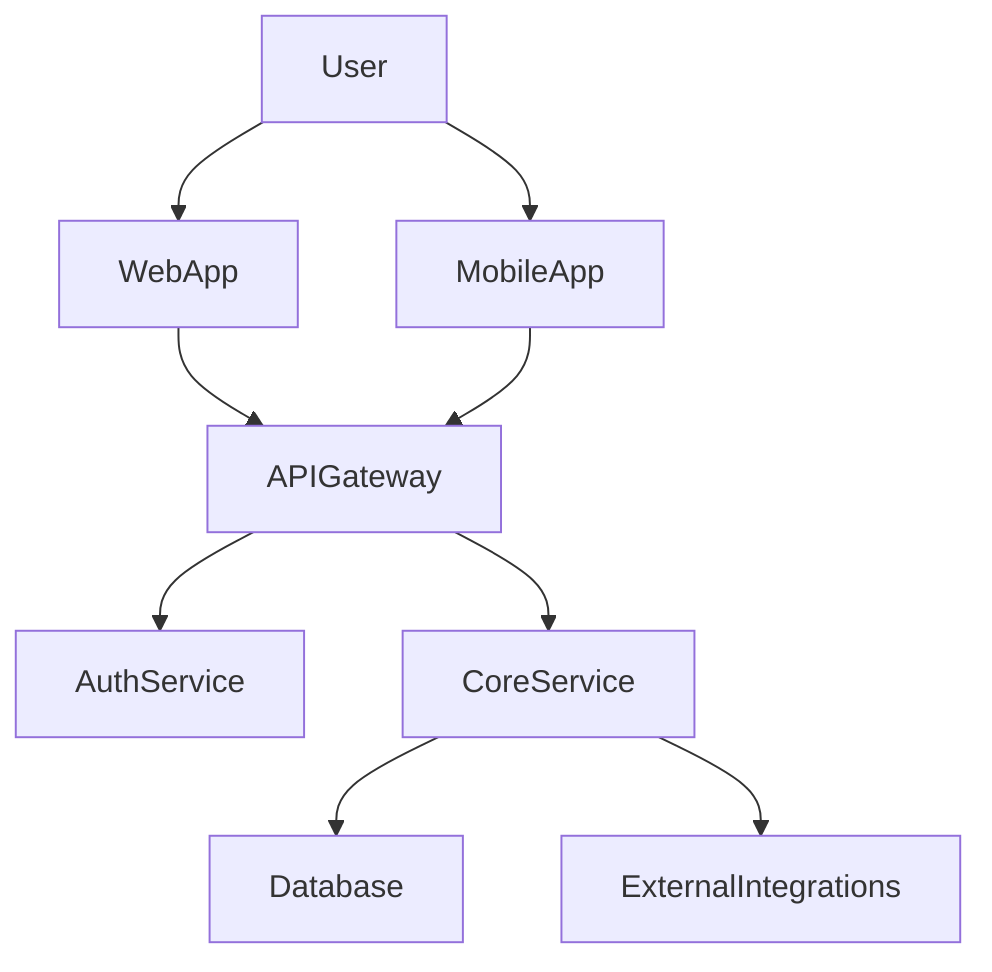

# Technology Architecture (High-Level) — {{project_name}}

> **Boundary callout:** This is HIGH-LEVEL architecture for PRD authoring. It is NOT
> detailed design. Detailed design (interface specs, protocol details, data schemas,
> error matrices, code structure) is engineering's domain after PRD lands. v2 may add
> /brief-design tech-arch-detailed for sub-workstream depth (deferred).
>
> [CITED:svpg.com/factors-in-structuring-a-product-organization|Marty Cagan SVPG Experience/Platform team topology|2026-04-25]

## 1. System Component Map (Mermaid diagram)

{{LLM populates the actual component map for this project. B2B variant: include SAML/SSO + audit-log-export edges. B2C variant: include app-store distribution + payment processor + analytics SDK edges. Stay HIGH-LEVEL — component names + capability labels only, NOT interface signatures.}}

## 2. Component Responsibilities

| Component | Owner team (Experience / Platform) | Primary capability | Build vs Buy |
|-----------|-----------------------------------|-------------------|--------------|
| {{...}} | {{Experience or Platform per Cagan SVPG topology}} | {{1-line capability — NOT signatures}} | {{Build / Buy / Hybrid}} |

{{LLM populates one row per component from Section 1. For early-stage teams most components are Experience-team-owned; Platform layer emerges as 3+ Experience teams duplicate. NO interface signatures. NO protocol details. NO schema columns.}}

## 3. Data Flow (the canonical user journey)

{{LLM narrates the primary use case from input to output, in plain language. Example:
1. User opens MobileApp and signs in via AuthService
2. AuthService validates credentials (or SSO token for B2B); returns session
3. User initiates {primary action} in MobileApp
4. MobileApp calls APIGateway → CoreService
5. CoreService writes to Database and triggers ExternalIntegration if applicable
6. CoreService returns response → APIGateway → MobileApp → User

Reader can trace the primary use case end-to-end. Do NOT include field-level schemas
or HTTP verbs / payload structures here — that's PRD work.}}

## 4. Build Sequence (NOT a detailed roadmap — a build order)

- **Foundation:** {{What MUST come first — typically auth service, core data model, deploy/observability backbone, payment integration if monetization is day-1}}
- **Core:** {{Next layer — primary user-facing capability that exercises Foundation}}
- **Extensions:** {{Features that depend on Core — typically growth features, secondary integrations, admin/console surfaces}}

{{LLM populates per project shape. Stay layer-level — do NOT enumerate sprint-level tasks.}}

## 5. External Dependencies & Service Boundaries

| External service | Purpose | SLA expectation | Failure mode | Region availability |
|------------------|---------|-----------------|--------------|---------------------|
| {{...}} | {{...}} | {{e.g., 99.9%, p95 < 200ms}} | {{degrade to read-only / fail-closed / queue-and-retry}} | {{global / EU-only / KR-required}} |

{{LLM populates one row per external dependency. B2B variant typically includes identity provider (Okta / Azure AD), audit log destination (Splunk / Datadog), data warehouse. B2C variant typically includes app stores, payment processor, attribution, analytics, push notification, content delivery. region:kr variant adds 본인인증 PASS/KMC, Toss Payments / KakaoPay, ISMS-P data-residency boundary.}}

## 6. Out of Scope (explicit non-goals — what we will NOT build in v1)

{{LLM lists 3-5 explicitly out-of-scope items per DSG-09 boundary discipline. Examples: "Full multi-tenant isolation hardening (deferred to post-Series-A)", "On-prem deployment option (consumer app — not applicable)", "Real-time collaborative editing (not a v1 capability)", "Internationalization beyond Korean + English (deferred)".}}

## 7. Open Questions for Engineering PRD

{{LLM enumerates 5-10 most important questions PRD authoring should resolve. Examples:
- Which auth provider for B2B SSO? (Okta vs Auth0 vs WorkOS)
- Mobile-first vs web-first launch?
- Synchronous vs async architecture for the primary write path?
- Multi-region from day 1, or single-region with later migration?
- How does the offline / poor-connectivity path work for the mobile app?

These are HIGH-LEVEL questions. Detail-level questions (e.g., which encryption mode for
cache, which retry policy for transient failures) are PRD-and-after work.}}

## Sources

- OBJECTIVES.md — `{{[VERIFIED:.planning/OBJECTIVES.md|YYYY-MM-DD]}}`
- BMC artifact — `{{[VERIFIED:.planning/workstreams/business-model-canvas/canvas.md|YYYY-MM-DD]}}` (if completed)
- GTM artifact — `{{[VERIFIED:.planning/workstreams/go-to-market/gtm-plan.md|YYYY-MM-DD]}}` (if completed)
- DISCOVER outputs cited inline above
- Marty Cagan SVPG team topology reference — `{{[CITED:svpg.com/factors-in-structuring-a-product-organization|2026-04-25]}}`
